# Orbit Bluetooth

A planetary Bluetooth manager for [DankMaterialShell](https://github.com/AvengeMedia/DankMaterialShell).
Your machine sits at the center of a small star system and nearby devices float
around it. Drag a device toward the center to connect it, pull it away to
disconnect it. Charging devices receive a beam of energy from the core.

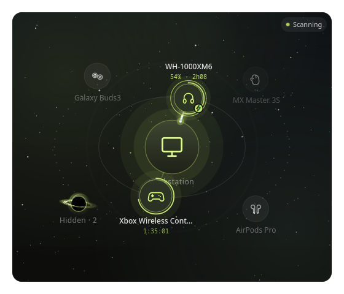

| Drag to connect | Energy beam while charging |
| --- | --- |
| 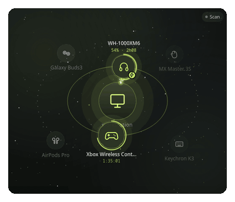 | 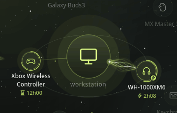 |

- Works in the **Control Center**, the **bar** and as a **desktop widget**
- Drag-to-connect with magnet snap, elastic tether to disconnect
- Live **charging** view: magnetic charging beam, time to full, speed, session chart
- **Earbuds trio**: case and both buds in their own mini orbit, each with its battery
- Battery gauge colored by level (red → amber → gold → lime → aqua)
- 28 built-in line-art device icons, matched by name
- Idle scenes use no frames at all; nothing leaves your machine

## Gallery

| Charging in orbit | Charging details |
| --- | --- |
| 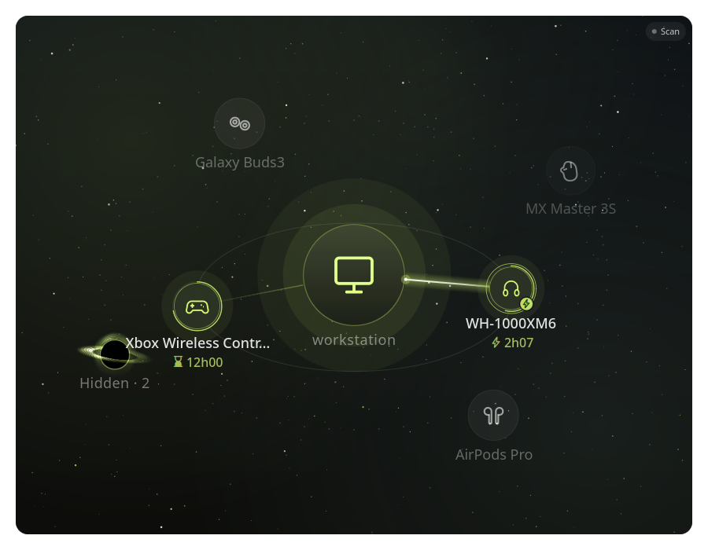 | 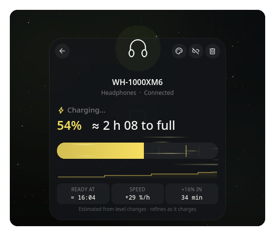 |

| Desktop widget | Desktop widget, detail card |
| --- | --- |
| 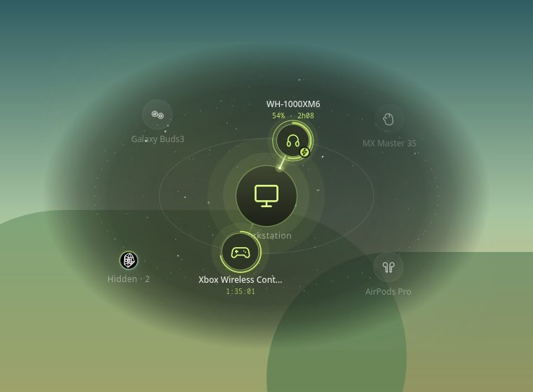 | 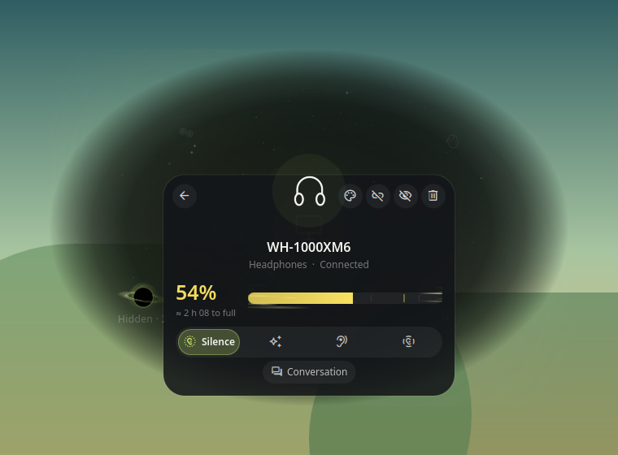 |

| Earbuds trio | Buds charging in their case |
| --- | --- |
| 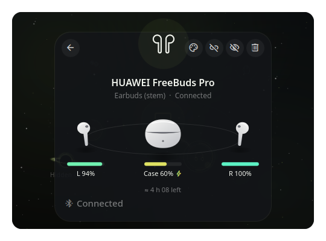 | 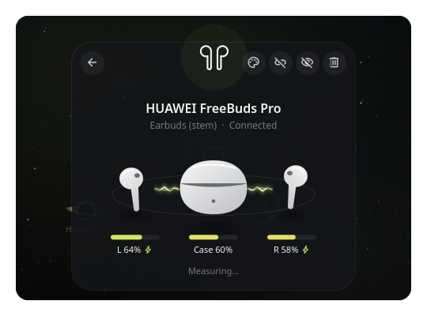 |

*Screenshots and animations are rendered from mock data with
`scripts/preview/render.sh` and `scripts/preview/record.sh`.*

## Requirements

| | |
| --- | --- |
| DankMaterialShell | 1.6.0 or newer |
| Quickshell | 0.3 or newer (ships with DMS) |
| BlueZ | any recent version, adapter powered on |
| UPower | optional, gives real charging states for devices that report one |
| Python 3 | optional, standard library only: headphone noise control |

## Installation

1. Put this folder in your DMS plugin directory, named `orbitBluetooth`:

   ```sh
   cd ~/.config/DankMaterialShell/plugins
   git clone <repository-url> orbitBluetooth
   ```

2. Open **Settings → Plugins**, enable **Orbit Bluetooth**.
3. Add the surfaces you want (next section). No restart is needed.

## Surfaces

### Control Center

Enter the Control Center edit mode and add the **Bluetooth** tile from Orbit
Bluetooth.

- Click the tile icon to turn Bluetooth on or off.
- Click the arrow to expand the orbit view inline.
- The view stays compact; it grows while a detail card is open so the whole
  card fits without scrolling.

### Bar

Add **Orbit Bluetooth** to any bar section.

- Left click opens the orbit view in a popout.
- The popout grows while a detail card is open, so the whole card fits.
- Right click turns Bluetooth on or off.
- Connected devices appear as tiny glyphs in the pill.

### Desktop

Add **Orbit Bluetooth** from **Settings → Desktop widgets**, then move and
resize it like any other widget (default 440 × 380).

- It is frameless: a smoky veil tinted with your theme accent fades out into
  the wallpaper. Tune it with **Desktop backdrop**.
- It stays frozen until the pointer is over it. The scan chip only shows while
  you use it.
- The detail card closes by itself when the pointer leaves or another window
  takes focus.

## Using the orbit

| Gesture | Result |
| --- | --- |
| Drag a device inside the inner ring | Magnet snap; release to pair and connect |
| Drag a connected device outward | Elastic tether; release to disconnect |
| Hover a connected device, click × | Disconnect |
| Click a device | It flies onto a detail card |
| Right-click a device | Menu: connect or disconnect, noise-control modes, hide |
| Drag a device into the black hole | It is swallowed and hidden (it stays connected) |
| Click the black hole | List of hidden devices, with **Show** to bring one back |
| Click the center, or the **Scan** chip | Start discovery |
| Esc, click outside, or ← | Leave the detail card |

Connected devices orbit on the inner ring, the others float in the outer
field. Connected devices are drawn 15% smaller so the ring stays airy. While
a connection is being made, a small comet circles the device. Named devices
are ranked before devices that only expose a MAC address.

### Hiding devices: the black hole

A small black hole drifts in the outer field with the unpaired devices.
Drag a device you never use into it (or right-click it and pick **Hide**)
and it spirals in and disappears from the orbit and the bar. It stays
connected. Click the black hole to see what it holds and click **Show** to
spit a device back out. With nothing hidden, clicking it explains what it is
for.

The black hole bends the starfield around it like a gravitational lens. Pick
its look in the settings (**Black hole style**):

- **Black hole** (default): a realistic one in the spirit of *Interstellar*,
  with a thin accretion disk seen almost edge-on, the far side of the disk
  bent over the shadow, a brighter approaching side and a photon ring,
  tinted by your theme.
- **Three-dimensional shadow of a four-dimensional bubble**: a wireframe
  tesseract turning inside the horizon (a nod to the hypercube in
  *Adventure Time*).

Both are a single small shader and only move while the scene is already
animating, so they cost nothing at rest. On the desktop widget the lens is off because the sky there
is see-through.

| 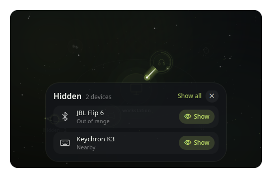 | 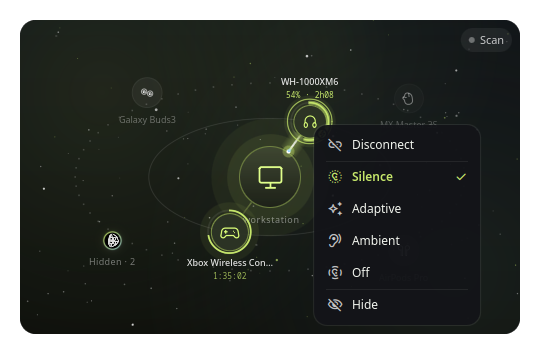 |
| --- | --- |

### Example: connecting new headphones

1. Put the headphones in pairing mode.
2. Open the orbit view. Discovery starts on its own (click **Scan** if
   *Scan automatically* is off), and the chip reads **Scanning**.
3. The headphones appear in the outer field. Drag them toward the center;
   the ring lights up and pulls them in.
4. Release. They pair, connect, and settle on the inner ring with their
   battery arc.


### The detail card

Click any device to open it: its glyph flies onto the card.

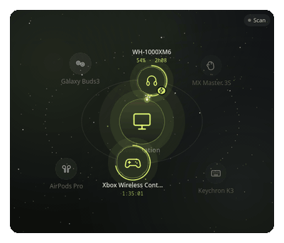

The card shows:

- name, type and state (connected, paired, available)
- connection time and battery level
- actions: change icon, connect or disconnect, hide, forget (asks twice)
- battery gauge, session chart and stats (see below)
- for earbuds, the **trio** (next section)
- noise control, for supported headphones (next section)

### Earbuds: the trio

Earbuds that report their parts (case, left, right) get a small orbit of
their own in the detail card: the case in the middle, one bud at each end,
each with its battery bar. A bud charging in the case moves closer to it,
its battery bar following it, and field lines join the case to the bud.


The drawings are chosen by name (stem or pebble buds, tall, wide or pebble
case, white or graphite). To use your own photos, put them in the
**Custom images folder** as `<name> case.png`, `<name> left.png` and
`<name> right.png` (the left picture is mirrored when there is no right one).

## Noise control

Supported headphones get a mode selector in their detail card, a halo in
the orbit (solid: cancelling, dotted: ambient) and the modes in their
right-click menu. Only what the model supports is shown: noise cancelling,
adaptive, ambient (transparency) and off, the ambient level, voice focus,
conversation detection and the left/right/case batteries.

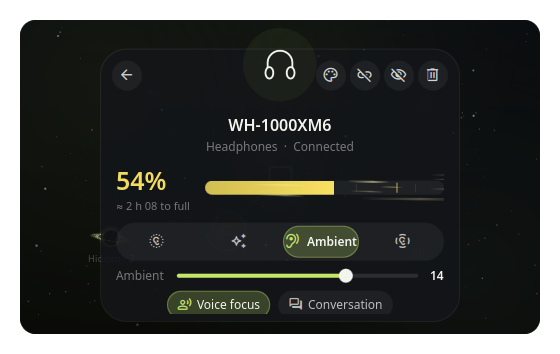

| Brand | Models | Tested on hardware |
| --- | --- | --- |
| Sony | WH-1000XM3 to XM6, WF-1000XM3 to XM5, LinkBuds, WH-CH720N, ULT WEAR… | Yes (WH-1000XM6) |
| Apple | AirPods Pro, AirPods 4, AirPods Max, Beats with noise control | No (untested) |
| Samsung | Galaxy Buds, Buds+, Live, Pro, Buds2 to Buds4 (Pro, FE, Core) | No (untested) |
| Bose | QC35 / QC35 II, NC700, QC45, QC Ultra, QC Headphones | No (untested) |
| Nothing / CMF | Ear (1), (2), (3), (a), Headphone (1), CMF Buds and Headphone Pro | No (untested) |
| Anker Soundcore | Life Q30/Q35, Liberty Air 2 Pro, Space Q45, others with the common layout | No (untested) |
| Huawei / Honor | FreeBuds 4i to 6i, Pro to Pro 5, SE 4, Studio, FreeLace Pro, FreeClip, Honor Earbuds 2 | Yes (FreeBuds Pro) |
| Oppo / OnePlus / realme | realme Buds T200 and Air6 Pro; other Enco/realme/OnePlus models are probed | No (untested) |
| Xiaomi | Redmi Buds 3 Pro, 4 Active, 5 Pro, 6 (Pro, Lite, Active), 8 Active | No (untested) |
| EarFun | Air Pro 4, Air S, Free Pro 3 | No (untested) |
| Moondrop | Space Travel 2, Space Travel 2 Ultra | No (untested) |
| Haylou | S35 ANC (mode can be set, not read) | No (untested) |
| 1MORE | SonoFlow, SonoFlow SE | No (untested) |

Untested brands follow their protocol documentation byte for byte and are
covered by unit tests, but have not met a real headset yet. If yours does
not answer, it simply shows no noise control; reports are welcome. Not
supported (no reliable public documentation): Jabra, JBL, Sennheiser,
Marshall, Google Pixel Buds.

How it works: QML cannot open a Bluetooth socket, so a small helper
(`anc/orbit_anc.py`, Python standard library only) talks to the headset.
The **Engine** setting decides when it runs:

- **On demand** (default): only while an Orbit view is open (Control Center,
  popout, visible desktop widget), or for the second it takes to apply a
  command. The helper waits for the headset to speak, so plugging in or
  unplugging the charger shows up at once, with no polling. Nothing runs
  once the view is closed.
- **Always connected**: one session per connected headset, so changes made
  with the headset's own buttons show up live (a small idle process).

Noise control only talks to **paired** headsets: opening a channel to a
device that is connected but not paired would make it drop and reconnect.

Some headsets cannot report every mode when asked (the WH-1000XM6 reads
"noise cancelling" and "off" the same way); Orbit then keeps the last mode
it set or saw.

## Charging and battery data

A charging device gets a lightning badge, a breathing battery arc and a beam
of energy from your machine to it: many faint field lines that fan out into a
spindle and meet again at the device, each waving at its own pace, like iron
filings around a magnet (drawn by a shader, only while visible).
Under its name you read the level and the time to full, for example
`54% · 2h08`.


The detail card adds:

| Field | Example | Meaning |
| --- | --- | --- |
| Readout | `54%  ≈ 2 h 08 to full` | Level (in its color) and time to full |
| **READY AT** | `≈ 15:45` | Clock time when it should be full |
| **SPEED** or **POWER** | `+29 %/h` or `4.5 W` | Charge rate (power when the device reports it) |
| **+16% IN** | `34 min` | Gained during this charge, and for how long |
| **HEALTH** | `92%` | Battery health, when reported |
| Chart | step line | Level over the current connection |

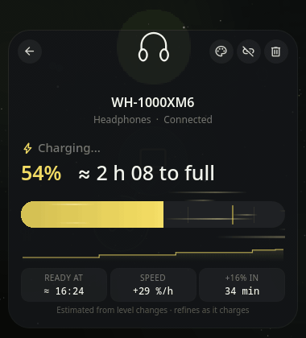

When not charging, the readout shows the time left and the tiles switch to
**EMPTY AT** and **DRAIN**. The gauge is a matte pill colored by level, with
light-speed streaks that flow while charging and a mark at 80%.

### Where the numbers come from

Bluetooth itself only reports a percentage, so the plugin combines two
sources:

1. **Reported by the device.** Headsets with noise control report their own
   charging state through the helper (Sony, Huawei and others, per part for
   earbuds; a charging case alone does not mark the buds as charging).
   Devices with a kernel battery driver (most game
   controllers, Logitech peripherals, …) publish a real state through UPower.
   The plugin maps them to their Bluetooth address by reading `HID_UNIQ` from
   sysfs once per device.
2. **Estimated from level changes.** Otherwise, charging is inferred from a
   rising level. Time to full accounts for the usual lithium-ion slowdown
   past 80%. Estimates are shown with `≈` and refine as more steps arrive.
   It takes a few level changes (usually a few minutes) before the first
   estimate appears.

The card's footnote always says which source is in use.

## Keyboard shortcuts (IPC)

Bind these to keys in your compositor:

```sh
dms ipc call orbitBluetooth anc nc       # nc, ambient, off or adaptive (first supported headset)
dms ipc call orbitBluetooth ancCycle     # next noise-control mode
dms ipc call orbitBluetooth ancStatus    # current noise-control state (JSON)
dms ipc call orbitBluetooth hidden       # list hidden devices
dms ipc call orbitBluetooth unhideAll    # bring every hidden device back
```

## Settings

| Setting | Default | Description |
| --- | --- | --- |
| Devices in orbit | 8 | Connected devices are always shown; the rest are ranked by pairing and name |
| Show unnamed devices | off | Devices that only expose a MAC address |
| Always show names | on | Otherwise names appear on hover |
| Scan automatically | on | Start discovery when a view opens; when off, scan only from the center or the **Scan** chip |
| Scan duration | 45 s | Discovery stops after this delay or when the view closes (or *While open*) |
| Center device | Automatic | Icon of this machine (laptop or desktop is detected) |
| Custom images folder | — | PNG files that replace built-in icons |
| Shooting stars | on | Occasional meteor in the background |
| Star density | Normal | Low, Normal or High |
| Desktop backdrop | 72% | Depth of the veil behind the desktop widget |
| Ambient motion on desktop | off | Keep orbits moving when the pointer is away |
| Black hole style | Black hole | Realistic, or "Three-dimensional shadow of a four-dimensional bubble" (tesseract) |
| Headphone noise control | on | Controls supported headphones (needs Python 3) |
| Engine | On demand | When the noise-control helper runs (see *Noise control*) |
| Sounds | off | Short cues on snap, connect and disconnect |
| Sound volume | 60% | |

## Device icons

Icons are matched by name patterns, for example every `WH-1000XMx`,
`AirPods Max`, `MX Master`, `Galaxy Buds`, `G703` or `DualSense`. The BlueZ
device class breaks ties, so a `G733` headset is never drawn as a mouse.

To change one, open its detail card and click the palette button. Your
choice is remembered per device. **Reset custom device icons** in the
settings clears all choices.

To use your own artwork, set **Custom images folder** and add PNGs named
exactly like the devices:

```
~/Pictures/bluetooth/
├── WH-1000XM6.png
├── Xbox Wireless Controller.png
└── MX Master 3S.png
```

Characters that are not allowed in file names (`/ \ : * ? " < > |`) are
replaced by `_`.

## Privacy

- No network access, no telemetry.
- The only process is the noise-control helper (Python, standard library):
  it opens a local Bluetooth socket to your headset and nothing else, only
  while needed (see *Noise control*). Set `ORBIT_ANC_DEBUG=1` to see its raw
  packets on stderr; nothing is ever logged to a file.
- Connection times and battery history live in memory for the current
  session only. They are never written to disk.
- The only files read are the sysfs `uevent` of kernel batteries, once each,
  to match them to a Bluetooth address.
- Settings (your choices, custom icon picks, the addresses and names of
  hidden devices) are stored by DMS with your other plugin settings.

## Performance

- One `FrameAnimation` drives physics, orbits and twinkles. It stops as soon as
  the scene settles or is hidden.
- The desktop widget renders zero frames while idle.
- Backgrounds (stars, nebulae, veil) are painted once. Charging effects only
  move fixed geometry, mostly with render-thread animators.
- Discovery runs only while a view is open and stops after the configured delay.
- The device list polls only while someone is looking or discovery runs.
- Sounds load the multimedia backend only when enabled.
- The black hole is one small fragment shader (either style). Its sky patch is re-sampled only
  when the stars change, and it only turns while the scene is awake.
- Honors DMS **Reduce motion**.

## Troubleshooting

**Earbuds keep disconnecting after a few seconds.** Some earbuds (FreeBuds
among others) ask you to confirm a pairing code. Orbit shows DMS's pairing
dialog for them; accept it once and they stay connected.

**No devices appear while scanning.** Make sure the device is in pairing mode.
Devices that only broadcast a MAC address are hidden unless **Show unnamed
devices** is on, and the orbit keeps at most **Devices in orbit** entries.

**A device charges but shows no lightning.** It reports no charging state and
its level has not risen yet. The estimate starts after the first level
increase.

**Noise control does not appear.** The headset must be connected and its
brand supported (see *Noise control*); Python 3 must be installed. Close and
reopen the card to retry: after an error the helper stays quiet instead of
retrying in a loop.

**A device vanished.** It may be in the black hole: click it, or use
**Show all hidden devices** in the settings, or
`dms ipc call orbitBluetooth unhideAll`.

**The time to full looks off.** Estimates rely on the device's level steps.
Some headsets report in 10% steps, so the first minutes are rough and improve
over time.

## Development

```
orbitBluetooth/
├── plugin.json
├── OrbitBluetoothDaemon.qml     # connection times, battery log, UPower bridge
├── OrbitBluetoothWidget.qml     # Control Center tile, bar pill and popout
├── OrbitBluetoothDesktop.qml    # desktop widget
├── OrbitBluetoothSettings.qml
├── components/
│   ├── OrbitScene.qml           # the scene: physics, drag, focus, chrome
│   ├── DeviceBody.qml           # one orbiting device, charging beam
│   ├── FocusCard.qml            # detail card
│   ├── BlackHole.qml            # the "Hidden" black hole (picks one of two shaders)
│   ├── HiddenCard.qml           # list of hidden devices
│   ├── OrbitMenu.qml            # right-click menu
│   ├── BatteryCard.qml          # gauge, chart and stat tiles
│   ├── StatTiles.qml            # READY AT / SPEED / HEALTH tiles
│   ├── EarbudsTrio.qml, EarbudArt.qml, Earbuds.js   # case + buds mini orbit
│   ├── EnergyBeam.qml           # magnetic field-line beam (beam.frag)
│   ├── Charge.js                # charge analysis and color ramp (pure)
│   ├── Endurance.js             # rated battery life per model (time-left estimate)
│   ├── AncService.qml, AncPanel.qml, Anc.js   # noise control (runs the helper)
│   ├── Starfield.qml, Vignette.qml, DeviceGlyph.qml, …
├── anc/
│   ├── orbit_anc.py             # noise-control helper (stdin/stdout JSON session)
│   ├── sdp.py                   # minimal SDP client (finds RFCOMM channels)
│   ├── protocols/               # one module per brand + shared checksums
│   └── tests/                   # unittest: frames, checksums, each brand
├── tests/anc.test.js            # gjs: brand detection, modes, time left
├── shaders/                     # beam.frag, gargantua.frag, tesseract.frag + compiled .qsb, build.sh
├── scripts/
│   ├── gen_sounds.py            # synthesizes sounds/*.wav (stdlib only)
│   └── preview/                 # offscreen renderer with mock services
├── screenshots/
└── sounds/
```

DMS reloads QML on save, but Qt keeps `components/` and `.js` files cached
in the running shell: run `dms restart` after changing them before judging
the result. Set `ORBIT_ANC_DEBUG=1` in the shell's environment to see the
noise-control packets.

Regenerate the screenshots and GIFs (mock devices, no real data; the GIFs
need `ffmpeg`; the shader needs the OpenGL backend, which `render.sh` sets):

```sh
scripts/preview/render.sh          # PNG screenshots
scripts/preview/record.sh          # all GIFs
scripts/preview/record.sh beam     # one of: beam, gauge, focus, connect
```

Recompile the shaders after editing a `shaders/*.frag` file (needs Qt's
`qsb`):

```sh
shaders/build.sh
```

Run the tests:

```sh
(cd anc && python3 -m unittest discover -s tests -t .)
gjs tests/anc.test.js
```

Regenerate the sounds:

```sh
python3 scripts/gen_sounds.py
```

## Credits

The noise-control protocols were written from the public documentation and
reverse-engineering notes of these projects (protocols reimplemented, no
code copied): Gadgetbridge, SonyHeadphonesClient (mos9527), XMDeck,
LibrePods, MagicPodsCore, GalaxyBudsClient, based-connect, bosectl,
OpenSCQ30, OpenFreebuds, EarA-linux, earctl and cmfctl. SAFER+ follows the
Bluetooth Core specification.

## License

MIT © lung595
