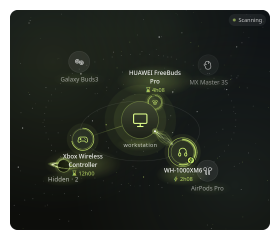
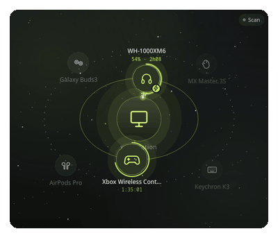
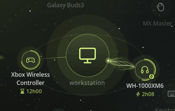
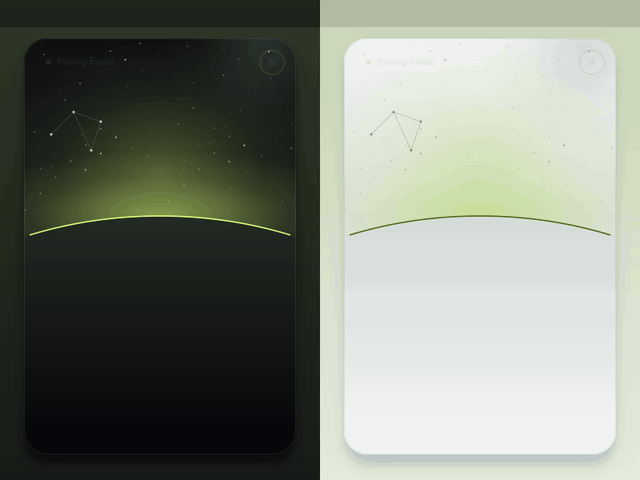
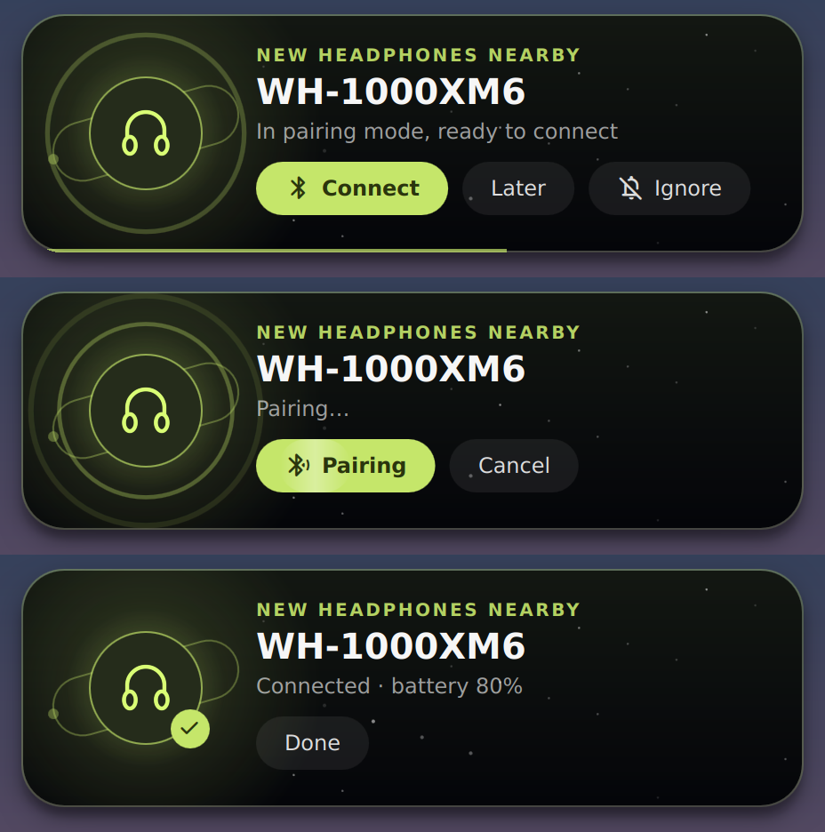

<div align="center">

# Orbit Bluetooth

**A planetary Bluetooth manager for [DankMaterialShell](https://github.com/AvengeMedia/DankMaterialShell).**

Your machine sits at the center of a small star system and nearby devices float around it.
Drag a device to the center to connect it, pull it away to disconnect it.



[Getting started](#getting-started) · [Usage](#usage) · [Settings](#settings) · [Troubleshooting](#troubleshooting) · [User guide](docs/GUIDE.md) · [Changelog](CHANGELOG.md)

</div>

## Getting started

### Requirements

| Dependency | Version | Needed for |
| --- | --- | --- |
| DankMaterialShell | 1.6.0 or newer | Everything |
| BlueZ | Any recent version, adapter powered on | Everything |
| UPower | Any | *Optional*: real charging states |
| PipeWire | Any | *Optional*: the two volumes of audio devices (`pw-play` for the tick, `cava` for the picture of the sound) |
| Python 3 | Standard library only | *Optional*: headphone noise control |

### 1. Install

From the plugin browser: **Settings → Plugins**, search for **Orbit Bluetooth**, click *Install*. Or from a terminal:

```sh
dms plugins install orbitBluetooth
```

<details>
<summary>Manual install</summary>

```sh
git clone https://github.com/lung595/orbitBluetooth ~/.config/DankMaterialShell/plugins/orbitBluetooth
```

Then click **Settings → Plugins → *Scan for plugins***.
</details>

### 2. Enable

In **Settings → Plugins**, turn **Orbit Bluetooth** on.

### 3. Add a widget

> [!IMPORTANT]
> **Orbit Bluetooth does not replace the built-in DMS Bluetooth widget.** Nothing shows up until you **add at least one of its widgets** yourself.

| Where | How to add it |
| --- | --- |
| **Control Center** | Open the Control Center, enter **edit mode**, add the **Bluetooth** tile from *Orbit Bluetooth* |
| **Bar** | **Settings → Appearance → DankBar Layout**, add **Orbit Bluetooth** to a section |
| **Desktop** | **Settings → Desktop Widgets**, add **Orbit Bluetooth**, then move and resize it |

> [!TIP]
> To avoid two Bluetooth tiles in the Control Center, remove the built-in one in edit mode.

### 4. First steps

1. **Open the orbit** from the widget you added. Discovery starts on its own.
2. **Drag a device into the inner ring** to pair and connect it; drag it back out to disconnect.
3. **Click a device** for its detail card: battery, charging, noise control, and the two volumes of audio devices.
4. **New headphones?** Put them in pairing mode: within a minute a pairing sheet unfolds from the bar and offers to connect them, even with Orbit closed.

## Features

| Drag to connect | Energy beam while charging |
| --- | --- |
|  |  |

| New headphones pop-up | Dark and light themes |
| --- | --- |
|  |  |

- **New headphones? Orbit notices.** Put them in pairing mode and a pairing sheet unfolds from the bar: the headset falls into orbit and floats above a planet, *Connect* pairs it on the spot, shows its battery and its noise-control modes. Deep space in a dark theme, stratosphere in a light one, with any DMS palette. Works with Orbit closed.
- **Drag to connect** with a magnet snap, elastic tether to disconnect.
- **Two volumes**: open a connected audio device and its card shows the device's own level and this PC's as two half circles, with the sound itself moving inside. Drag or scroll each, click the planet to mute, and a soft tick plays in the device itself.
- **Volume pop-up and smart steps**: whenever a volume changes, the same screen shows both levels inside Dank Island (or in place of DMS's OSD, which is switched off); 1 % per slow notch, faster when you scroll or press fast, and your volume keys can use it in one click.
- **Listen together**: drag one connected audio device onto another and both play the same sound; drag a third (up to four) onto any of them. The volumes' half circle splits into one arc per output, and **the source takes the center of the view** while the others circle it, with a ring around it for the group's volume, and this computer circles the group like a sun. It comes apart by itself when one disconnects, and ends with the shell.
- **What really plays**: a short line under the device name and in the pop-up, for example *Bluetooth · LDAC · 96 kHz · 24 bit*, and a button that unfolds the rest: channels, profile, the codec's bit rate, latency and the audio quantum, each only when it can be honestly read.
- **Live charging**: energy beam, time to full, charge speed, session chart.
- **Earbuds trio**: the case and both buds in their own mini orbit, each with its battery.
- **Noise control** for 13 headphone brands (Sony, Apple, Samsung, Bose, Huawei…).
- **Pause when you take the headset off** (Sony headsets with a wearing sensor): what plays on the headset pauses when you take it off and resumes when you put it back, only what Orbit paused, and it never starts music; in a Listen together group it pauses nothing, the others keep playing. It keeps one control connection open ([more](docs/GUIDE.md#pause-when-you-take-the-headset-off)).
- **How long a conversation lasts** (Sony): *Short*, *Standard*, *Long* or *Never*, right in the headset's card ([more](docs/GUIDE.md#how-long-a-conversation-lasts)).
- **Real device pictures** (opt-in, uses the internet): a photo of your headphones, phone or TV instead of an icon.
- **Black hole**: drop a device you never use into it to hide it.
- **28 device icons** matched by name, or your own pictures.
- **Light and dark themes**; the sky always stays night.
- **Lightweight and private**: no frames drawn at rest, no telemetry, nothing leaves your machine unless you turn on real device pictures.

## Usage

| Gesture | Result |
| --- | --- |
| Put new headphones in pairing mode | A pairing sheet under the bar offers to connect them (<kbd>Enter</kbd> connects, <kbd>Esc</kbd> later) |
| Drag a device inside the inner ring | Pair and connect |
| Drag a connected device outward | Disconnect (a device of a listening group only leaves the group) |
| Click a device | Open its detail card |
| Scroll over a half circle, its icon or its percentage, or drag a moon | That level: the device's or this PC's, with smart steps; a soft tick plays in the device every 5 % ([more](docs/GUIDE.md#the-two-volumes)) |
| Click the planet of an open audio device | Mute or unmute |
| Drag a connected audio device onto another (or onto any device already in the group) | Listen together: the same sound on both, up to 4 outputs ([more](docs/GUIDE.md#listen-together)) |
| Scroll over the ring around the center planet, or over the planet | The group's general volume, the gaps between outputs kept ([more](docs/GUIDE.md#the-volume-at-the-center)) |
| Scroll over an output orbiting the center | That output's own volume |
| Click this computer (the sun around the group) | It takes the center back; click the group to bring it back ([more](docs/GUIDE.md#the-source-at-the-center)) |
| Right-click a device | Menu: connect, noise-control modes, leave or stop listening together, hide, forget |
| Forget a device (unpair) | Right-click → **Forget**, click again to confirm; or the 🗑 button of its detail card |
| Drag a device into the black hole | Hide it (it stays connected) |
| Click the black hole | List hidden devices, **Show** brings one back |
| Click the center, or the **Scan** chip | Start discovery |
| <kbd>Esc</kbd> | Step back: menu, hidden list, detail card |

In the **Control Center**, the tile icon turns Bluetooth on or off and the arrow expands the orbit. In the **bar**, left click opens the orbit, right click turns Bluetooth on or off.

📖 Everything else (detail card, renaming, earbuds, noise control and supported models, charging data, custom icons) is in the **[user guide](docs/GUIDE.md)**.

## Settings

**Settings → Plugins → Orbit Bluetooth**, grouped in tabs: Orbit, Scanning, Headphones (with device pictures), Sound, Desktop, Look. Options marked ⚡ use more battery.

| Section | Setting | Default |
| --- | --- | --- |
| Orbit | Devices in orbit | 8 |
| | Always show names | On |
| | Show unnamed devices (MAC address only) | Off |
| | Quick disconnect button (× on hover) | Off |
| | Center device | Automatic |
| | The listening source takes the center (Listen together) | On |
| Scanning | Scan automatically | On |
| | Offer new devices (a *Connect* card in the view) | On |
| | Pop-up for new headphones (listens to any search, free) | On |
| | Background scan (Orbit searches by itself) ⚡ | Off |
| | Background scan interval / battery threshold (shown when the scan is on) | Every minute / 30 % |
| | Scan duration: 20 s, 45 s, 90 s or *While open* ⚡ | 45 s |
| Headphones | Noise control | On |
| | Turn off conversation awareness on disconnect | On |
| | Pause when you take the headset off (Sony with a wearing sensor; keeps a control connection open, [more](docs/GUIDE.md#pause-when-you-take-the-headset-off)) | On |
| | Engine: *On demand* or *Always connected* ⚡ | On demand |
| Sound | Separate PC volume (the device's level and this PC's, [more](docs/GUIDE.md#separate-pc-volume)) | On |
| | Steps: *Smart* or *Fixed* ([more](docs/GUIDE.md#smart-volume-steps)) / Speed-up / Step | Smart / Balanced / 5 % |
| | Volume keys: *Use smart steps* or *Give back to DMS* (niri, changed only when you click, [more](docs/GUIDE.md#volume-keys)) | DMS |
| | Volume pop-up: in the Dank Island, under the bar widget, right screen edge or off ([more](docs/GUIDE.md#volume-pop-up)) | In the Dank Island |
| | Pop-up screens: *Where I am* (only the focused screen) or *Every screen* ([more](docs/GUIDE.md#volume-pop-up)) | Where I am |
| | Pop-up size: Compact, Medium or Large | Medium |
| | Visualizer: Points, Rays, Waves or None / motion: Smooth or Light | Points / Smooth |
| | Sounds (short cues) / their volume | Off / 60 % |
| | Audio details: per fact (connection, profile, codec, bit rate, sample rate, bit depth, channels, latency, quantum, resampling), on the line / when unfolded ([more](docs/GUIDE.md#what-really-plays)) | Line: connection, codec, sample rate, bit depth; unfolded: all |
| | Volume tick (a soft tick in the device while you change its volume) | On |
| Desktop widget | Displays | All |
| | Backdrop | 72 % |
| | Ambient motion ⚡ | Off |
| Device pictures | Real device pictures (uses the internet) | Off |
| Look | Black hole: realistic or tesseract | Black hole |
| | Shooting stars | On |
| | Stars: Low, Normal or High | Normal |
| | Custom images folder | — |

## Command line and keybindings

```sh
dms ipc call orbitBluetooth anc nc       # nc, ambient, off or adaptive (first supported headset)
dms ipc call orbitBluetooth ancCycle     # next noise-control mode
dms ipc call orbitBluetooth ancStatus    # current noise-control state (JSON)
dms ipc call orbitBluetooth chatEnds standard  # how long a conversation lasts: short, standard, long or never (Sony)
dms ipc call orbitBluetooth wearStatus   # worn or removed, and what is held paused (Sony)
dms ipc call orbitBluetooth newDeviceDemo    # show the new-headphones pop-up with a made-up headset
dms ipc call orbitBluetooth newDeviceStatus  # is the background scan running, or why not
dms ipc call orbitBluetooth hidden       # list hidden devices
dms ipc call orbitBluetooth unhideAll    # bring every hidden device back
dms ipc call orbitBluetooth volume up    # up or down, with smart steps
dms ipc call orbitBluetooth deviceVolume 40  # the device's own level: up, down or 0-100
dms ipc call orbitBluetooth pcVolume -- -10  # this PC's level for it (a negative step needs --)
dms ipc call orbitBluetooth volumeKeys on    # on, off or status: your volume keys use smart steps
dms ipc call orbitBluetooth together "AA:BB:CC:DD:EE:01 AA:BB:CC:DD:EE:02"  # listen together: 2 to 4 addresses, one quoted argument
dms ipc call orbitBluetooth togetherAdd AA:BB:CC:DD:EE:03     # add one more output to the group
dms ipc call orbitBluetooth togetherRemove AA:BB:CC:DD:EE:03  # take one out (the group ends below two)
dms ipc call orbitBluetooth togetherDelay AA:BB:CC:DD:EE:02 120  # hold one output back, 0 to 500 ms, this session only
dms ipc call orbitBluetooth togetherStatus   # who listens together (JSON)
dms ipc call orbitBluetooth separate         # end listening together
```

Bind them in your compositor, for example in niri: `Mod+N { spawn "dms" "ipc" "call" "orbitBluetooth" "ancCycle"; }`, or in Hyprland: `bind = SUPER, N, exec, dms ipc call orbitBluetooth ancCycle`.

## Troubleshooting

| Problem | Solution |
| --- | --- |
| Nothing changed after installing | Add one of its widgets, see [Add a widget](#3-add-a-widget) |
| Earbuds disconnect after a few seconds | Accept the pairing code dialog once |
| No pop-up for new headphones | It appears when any tool searches for devices (Orbit's **Scan**, your system settings); turn on **Background scan** to have Orbit search by itself; the pop-up waits for full-screen windows |
| Something did not work | A short note says why, and the GitHub mark next to it opens the matching section of the guide |
| Bluetooth is off and **Turn on** does nothing | Airplane mode or a hardware switch blocks it: `rfkill unblock bluetooth`, see [Bluetooth is off](docs/GUIDE.md#bluetooth-is-off) |
| No devices appear while scanning | Put the device in pairing mode; turn on **Show unnamed devices** |
| A device charges but shows no lightning | Wait for its first level increase: the estimate starts then |
| Noise control does not appear | Headset must be paired and supported, Python 3 installed; reopen the card |
| Music does not pause when I take the Sony headset off | `dms ipc call orbitBluetooth wearStatus` says why; the Sony app on a phone may hold the headset's control connection, see [Pause when you take the headset off](docs/GUIDE.md#pause-when-you-take-the-headset-off) |
| A device vanished | It is in the black hole: click it, or `dms ipc call orbitBluetooth unhideAll` |
| Settings or widgets of Orbit left after removing it while DMS was not running | Install it again, then remove it from DMS while it runs: it cleans up after itself, see [Uninstalling](docs/GUIDE.md#uninstalling) |
| Volume keys still use smart steps after removing Orbit while DMS was not running | They still work (they fall back to DMS); give them back: `dms keybinds set niri XF86AudioRaiseVolume "spawn dms ipc call audio increment 3" --allow-when-locked`, same with `XF86AudioLowerVolume` and `decrement`, see [Volume keys](docs/GUIDE.md#volume-keys) |
| DMS's volume OSD stays off after removing Orbit | DMS saved its settings while Orbit held that switch off: turn **Volume** back on in DMS's *Settings → On-screen Displays*, see [DMS's own volume OSD](docs/GUIDE.md#dmss-own-volume-osd) |
| Listen together refuses a device | A short note says why (not connected, no sound output yet, on a call profile, four already) and the GitHub mark opens [Listen together](docs/GUIDE.md#listen-together) |
| An output orbiting the center ignores the wheel | It has no volume of its own (it follows this PC's level): a note says so, turn the ring around the center, see [The volume at the center](docs/GUIDE.md#the-volume-at-the-center) |
| The outputs of Listen together are not in sync | Hold the early one back with `togetherDelay`, see [Limits](docs/GUIDE.md#limits) |
| Time to full looks off | Some headsets report in 10 % steps; it improves over time |

Some Sony headsets do not report charging, or drop Bluetooth while charging: this is a hardware limit.

## Privacy

- **Safe pairing.** A new device is only trusted once Orbit has checked it is what it looks like; headphones that can also send key presses (for their buttons) are paired only if you say so. [More](docs/GUIDE.md#pairing-safety)
- **No telemetry.** Connection times and battery history stay in memory; settings, hidden and ignored devices are stored by DMS.
- **Noise control**: a small helper talks to your headset over a local Bluetooth socket, only while needed. With **Pause when you take the headset off** on, that connection stays open while a Sony headset with a wearing sensor is connected; Orbit pauses and resumes your players through MPRIS on the local D-Bus, keeps nothing and sends nothing; to the headset it sends one message when the connection opens, the request to log its wearing events.
- **New headphones pop-up**: by default Orbit only listens to searches you start yourself; nothing runs in the background. The optional **Background scan** (off by default) does a local scan of 8 s about once a minute, only while the screen is on, no Bluetooth audio is connected and the battery is above the threshold.
- **Two volumes**: talk to the local sound server (PipeWire) only; the tick is a sound file shipped with Orbit, the picture of the sound is read locally with `cava`.
- **Listen together**: one small local sound process per output beyond the first, only while a group listens; it talks to PipeWire only, saves nothing, logs nothing, and ends with the shell. [More](docs/GUIDE.md#listen-together)
- **Audio details**: read from PipeWire (`pactl list sinks`) while the card or the pop-up shows, only if a fact is chosen; kept in memory, dropped when it closes. Latency and bit rate also read the graph once with `pw-dump`, and the quantum once with `pw-top` (about 2 s), only while the details are unfolded (or the fact is on the line). Orbit never writes to PipeWire or to the headset.
- **DMS's volume OSD**: while Orbit's pop-up is on, Orbit holds DMS's *Volume* switch off, in memory only, and lets go of it around each of DMS's own saves, so nothing of it reaches DMS's files. [More](docs/GUIDE.md#dmss-own-volume-osd)
- **Volume keys**: only if you click *Enable*, Orbit asks DMS (`dms keybinds`) to bind them; *Undo* and uninstalling give them back exactly. [More](docs/GUIDE.md#volume-keys)
- **Guide links**: the GitHub mark opens the guide in your browser only when you click it; Orbit itself makes no request.
- **Network: only one opt-in feature, off by default.** **Real device pictures** sends only the *model name* of devices you have paired, never a stranger's device nearby, never the Bluetooth address. It contacts `commons.wikimedia.org`, then `api.sketchfab.com`, and downloads the picture from `upload.wikimedia.org` or `media.sketchfab.com`. Pictures are credited in the card, kept in `~/.cache/orbitBluetooth/pictures` (readable by you only) and erased when you turn the option off or from the settings.

- **Uninstalling leaves nothing.** When you remove Orbit from DMS, it erases what DMS keeps for it (its settings, its bar, Control Center and desktop widgets) and its pictures cache, and your sound goes back exactly as before. [More](docs/GUIDE.md#uninstalling)

Details in the [user guide](docs/GUIDE.md#privacy).

## Documentation

| File | Content |
| --- | --- |
| [docs/GUIDE.md](docs/GUIDE.md) | Full user guide |
| [CHANGELOG.md](CHANGELOG.md) | What changed in each version |
| [ROADMAP.md](ROADMAP.md) | Ideas for the future |
| [CONTRIBUTING.md](CONTRIBUTING.md) | Architecture, tests and release process, for anyone working on the code |

## Credits

Noise-control protocols were reimplemented from the public notes of Gadgetbridge, SonyHeadphonesClient, XMDeck, LibrePods, MagicPodsCore, GalaxyBudsClient, based-connect, bosectl, OpenSCQ30, OpenFreebuds, EarA-linux, earctl and cmfctl (no code copied). The Sony wearing sensor and the length of a conversation come from [mos9527](https://github.com/mos9527)'s MIT-licensed [SonyHeadphonesClient](https://github.com/mos9527/SonyHeadphonesClient), and the wearing sequence on the WH-1000XM6 was confirmed there by [phedoreanu](https://github.com/phedoreanu) (pull request [#63](https://github.com/mos9527/SonyHeadphonesClient/pull/63)): thank you both. The new-device pop-up is inspired by the nearby-device cards of Google Fast Pair and Apple's AirPods setup (the idea only: Orbit uses plain BlueZ discovery, no vendor protocol). Device pictures come from [Wikimedia Commons](https://commons.wikimedia.org) and [Sketchfab](https://sketchfab.com) (free licenses only, each author is credited in the card): thank you to the photographers and 3D artists who share their work. Built on [DankMaterialShell](https://github.com/AvengeMedia/DankMaterialShell) and [Quickshell](https://quickshell.org).

## License

[MIT](LICENSE) © lung595
