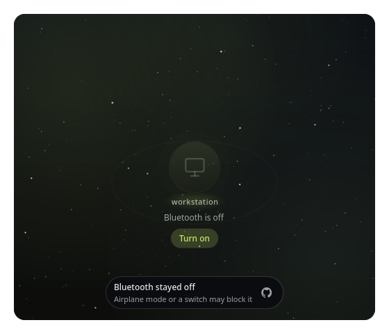
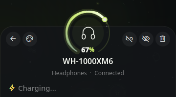

# Orbit Bluetooth: user guide

Everything Orbit Bluetooth can do, in detail. To install it and add a widget, see the [README](../README.md#getting-started).

## Contents

- [Widgets](#widgets)
- [The orbit](#the-orbit) · [If it does not connect](#if-it-does-not-connect) · [If it does not disconnect](#if-it-does-not-disconnect) · [Bluetooth is off](#bluetooth-is-off)
- [The detail card](#the-detail-card)
- [The two volumes](#the-two-volumes) · [Separate PC volume](#separate-pc-volume) · [Volume pop-up](#volume-pop-up) · [Smart volume steps](#smart-volume-steps) · [Volume keys](#volume-keys) · [What really plays](#what-really-plays)
- [Earbuds: the trio](#earbuds-the-trio)
- [Hiding devices: the black hole](#hiding-devices-the-black-hole)
- [Noise control](#noise-control)
- [Charging and battery](#charging-and-battery)
- [New headphones pop-up](#new-headphones-pop-up)
- [Pairing safety](#pairing-safety)
- [Real device pictures](#real-device-pictures)
- [Device icons](#device-icons)
- [Light theme](#light-theme)
- [Settings](#settings)
- [Privacy](#privacy)
- [Performance](#performance)

## Widgets

**Control Center.** Click the tile icon to turn Bluetooth on or off, the arrow to expand the orbit inline. The view stays compact and grows while a detail card is open, so the whole card fits.

**Bar.** Left click opens the orbit in a popout, right click turns Bluetooth on or off. Connected devices appear as tiny glyphs in the pill.

**Desktop.** A frameless orbit (default 440 × 380): a smoky veil tinted with your theme accent fades into the wallpaper. It stays frozen until the pointer is over it, and the detail card closes by itself when the pointer leaves. With *Ambient motion* on, the orbit keeps drifting, except behind windows: when they fill the screen (fullscreen, maximized or side by side), it freezes and costs nothing until the desktop shows again (niri).

| Desktop widget | Desktop widget, detail card |
| --- | --- |
|  |  |

## The orbit

| Gesture | Result |
| --- | --- |
| Drag a device inside the inner ring | Magnet snap; release to pair and connect |
| Drag a connected device outward | Elastic tether; release to disconnect |
| Hover a connected device, click × | Disconnect (when *Quick disconnect button* is on) |
| Click a device | It flies onto a detail card |
| Right-click a device | Menu: connect or disconnect, noise-control modes, hide |
| Drag a device into the black hole | It is swallowed and hidden (it stays connected) |
| Click the black hole | List of hidden devices, with **Show** to bring one back |
| Click the center, or the **Scan** chip | Start discovery |
| <kbd>Esc</kbd>, click outside, or <kbd>←</kbd> | Step back: menu, hidden list, then detail card |

Connected devices orbit on the inner ring, drawn 15 % smaller so the ring stays airy; the others float in the outer field. While a connection is being made, a small comet circles the device and sonar rings leave it. Named devices are ranked before devices that only expose a MAC address.

**Example: connecting new headphones.**

1. Put the headphones in pairing mode.
2. Open the orbit. Discovery starts on its own (click **Scan** if *Scan automatically* is off).
3. The headphones appear in the outer field. Drag them toward the center: the ring lights up and pulls them in.
4. Release. They pair, connect and settle on the inner ring with their battery arc.


### If it does not connect

When a device you dragged in does not connect, it springs back out and a short note under the center says what happened, with the GitHub mark linking here:

- **Could not pair…** — the device did not answer or declined. Put it back in pairing mode (often a long press on its button, until a light blinks), keep it close, and drag it in again. If it was paired with another computer or phone, turn that one's Bluetooth off first.
- **…did not connect** — it is paired, but did not answer in 25 s. Check that it is on, charged and nearby; some earbuds only connect once out of their case.
- **…was not paired** — Orbit could not read what the device does, so it did not trust it. See [Pairing safety](#pairing-safety).

The note goes away by itself after a few seconds, or stays while the pointer is on it. From the command line, `dms ipc call orbitBluetooth …` replies that something cannot be done with the same link.

### If it does not disconnect

When you pull a device out and it is **still connected** 8 seconds later, it springs back to its place on the inner ring and the note says **…is still connected**. The device or BlueZ refused: it may be busy (a call, a file transfer). Try again, or turn the device off. Nothing is retried on its own.

### Bluetooth is off

When Bluetooth is off, the orbit is empty and the center says **Bluetooth is off**, with a **Turn on** button.



- If **Turn on** changes nothing within 3 seconds, a note says **Bluetooth stayed off**: something blocks it. Turn off airplane mode, check a Bluetooth switch or key on the laptop, or run `rfkill list` in a terminal: a *Soft blocked: yes* line is lifted with `rfkill unblock bluetooth`; *Hard blocked: yes* is the switch.
- **No Bluetooth adapter** means the computer has none the system can use: no Bluetooth chip, a USB dongle unplugged, or the `bluetooth` service stopped (`systemctl status bluetooth`). Orbit needs BlueZ and an adapter; see *Requirements* in the README.

## The detail card

Click any device to open it: its glyph flies onto the card.


- **Name, type and state** (connected, paired, available).
- **Rename**: click the name of a paired device. <kbd>Enter</kbd> saves, <kbd>Esc</kbd> cancels, an empty name restores the device's own name. The new name is the Bluetooth alias, so every app shows it; icon, noise control and battery estimates still follow the device's own name.
- **Connection time and battery level.**
- **Volume** of connected audio devices: the device's own level and this PC's, see [The two volumes](#the-two-volumes).
- **Actions**: on the left, back and change icon (the card); on the right, connect or disconnect, hide, forget (asks twice) (the device).
- **Forget** unpairs the device (BlueZ removes it) and clears what Orbit kept about it: its icon choice and a *Don't offer again* mark, so it can be offered as new next time. Also in the right-click menu: **Forget**, then click again to confirm.
- **Battery gauge, session chart and stats** (see [Charging and battery](#charging-and-battery)).
- The **earbuds trio** and **noise control** when the device supports them.

## The two volumes

Open a **connected** audio device (headphones, speaker, earbuds, TV…) and its card shows **two volumes** on a small dark screen, the same one as Orbit's volume pop-up:



- **In the bar pop-out and the Control Center**, the two volumes start **folded into one thin line** (each level as a slim bar with its percentage), so the card fits without scrolling. The wheel over a level changes it (the device's on the left, this PC's on the right), with the same smart steps as the keys. Click it to unfold the screen; the ⌃ in its corner folds it back. Orbit remembers your choice until the shell restarts. Folded, the sound is not read at all. The desktop widget always shows the screen.
- **The outer half circle is the device's own level** (`primary` color), the one its buttons change. **The inner one is this PC's**: what the PC sends to it (`tertiary` color; when the theme's two accents look alike, such as a pink and a salmon, this PC takes the opposite hue, so the two never read as one). The icon at the foot of each says which is which, and the percentages stay next to them.
- **Inside, the sound itself**: where it goes, left or right, and how loud. Pick the style in the settings (*Points*, *Rays*, *Waves* or *None*). It only moves while the card is on screen and sound is playing.
- **Drag a moon** along its half circle for any level; **scroll** over it for Orbit's smart steps (1 % per slow notch, bigger when you scroll fast).
- **Click an icon** to mute that level. **Click the planet** to mute too: with one audio device connected it mutes this PC, with several it mutes that device only.
- **Scroll over the planet** to change the level you hear move first (the device's own when it has one).
- **A device with no level of its own** (no *absolute volume* over Bluetooth): its volume is this PC's, so the screen shows this PC's half circle alone and says *Its volume follows this PC*.
- **Volume tick**: a soft, short tick plays **in the device itself** at each 5 % step you make on the card, so you hear the level where it matters. Turn it off in **Sound → Volume tick**. It needs `pw-play` (part of PipeWire).
- Devices that are not connected, or have no sound output, show no screen: scrolling over a connected keyboard or mouse says **…has no volume** instead of doing nothing. Right after a headset connects, its audio can take a second to appear.

Everything talks to the local sound server (PipeWire) only. The picture of the sound is read with `cava` from the device's output, only while the card is open; with *Reduce motion* it does not run and the levels change at once.

### Separate PC volume

Many Bluetooth devices have a volume of their own (*absolute volume*): the level their buttons change. Then there are two levels on the way to your ears, and Orbit keeps them apart:

- **The device's level** is the one the device shows and remembers.
- **This PC's level** is what the PC sends to it. Orbit remembers it **per device**, so your speaker can sit at 100 % from the PC while your headset stays at 40 %.
- To carry this PC's level, Orbit adds a small sound filter in front of the device. It belongs to the shell and disappears with it; nothing in your sound setup is changed.
- Turn it off in **Sound → Separate PC volume**: no filter, and every device shows one level, as before.

Devices that follow this PC's level have one level only, whatever this setting says.

## Volume pop-up

When a volume changes, from a key, the command line or anywhere else, Orbit can show **both levels at once** in a small pop-up: the same dark screen as the card, with the device's half circle, this PC's, and the sound inside.

- **Where** (**Sound → Pop-up**): *In the Dank Island* (the default), *Under the bar widget*, *Right screen edge*, or *Off* to keep DMS's own OSD.
- **Dank Island**: on screens that have one, Orbit's screen appears **inside the island**, which grows to fit. A screen without an island gets the pop-up where DMS's OSD would show.
- **Only one volume pop-up**: with any choice but *Off*, DMS's own volume OSD is switched off, see [DMS's own volume OSD](#dmss-own-volume-osd).
- **Size** (**Sound → Size**): *Compact*, *Medium* (default) or *Large*.
- **It grows out of the island** with DMS's own spring, and folds back by itself. How it moves is up to DMS: *Settings → Dank Island → Reduce Motion* (or the global *Reduce Motion*) makes it follow the keys at once, which costs much less shell time.
- **Scroll over it** to keep changing the level with [smart steps](#smart-volume-steps); drag a moon or click an icon, as on the card. It closes by itself a moment after the last change.
- With no Bluetooth audio device, it shows this PC's level alone.

### DMS's own volume OSD

So that only one volume pop-up shows, Orbit switches DMS's own volume OSD off while its pop-up is on (any choice but *Off*). That also stops DMS's Dank Island from opening its own volume face before Orbit's.

- It is done **in memory**: Orbit holds DMS's *Volume* switch (*Settings → On-screen Displays*) off, and DMS's own value comes back when Orbit stops, when the plugin is turned off, or when you choose *Off*. Orbit writes nothing of DMS's.
- **DMS's saves are guarded.** DMS saves all of its settings together whenever one changes (a theme, a bar...) and once when it starts. Orbit lets go of the switch for a quarter of a second around each save, so the file keeps your own *Volume* value and removing Orbit leaves nothing behind. In that quarter of a second DMS's OSD could show if you press a volume key.
- **If DMS changes how it saves** (an update that renames the flag Orbit watches), Orbit cannot see the saves any more and the file may take the switch as off. Then turn **Volume** back on in DMS's *Settings → On-screen Displays*, and please open an issue.
- The microphone, brightness and other OSDs are not touched.

The sound inside is drawn only while the pop-up or a card shows:

- **Visualizer** (**Sound → Visualizer**): *Points* (a cloud: where the sound sits, left or right), *Rays* or *Waves* (its notes, bass at the top), or *None*.
- **Visualizer motion**: *Light* (30 images per second, the default) or *Smooth* (60, twice the work).
- It needs `cava`; without it, PipeWire's own peak meter draws one band per side. With *Reduce motion*, nothing moves.

## Smart volume steps

Orbit's own way of stepping the volume, for the wheel over the pop-up and the card and for the [volume keys](#volume-keys) once bound to Orbit:

- **Slow notches move by 1 %**, so you can land exactly where you want.
- **A quick run builds up speed**, up to a ceiling you choose in **Sound → Speed-up**: *Gentle* (3 %), *Balanced* (4 %, default) or *Fast* (6 %).
- **Turning back** to look for a spot holds the step small for a moment.
- Under 10 %, every step is 1 %.
- **The keys change the output you hear**, Bluetooth or not: with the sound on a wired interface and a headset connected, the interface moves and the headset stays where it is.
- **Sound → Steps → Fixed** gives the same step every time instead (**Step**, 5 % by default).
- From the command line: `dms ipc call orbitBluetooth volume up` or `down` (smart steps on the device you hear), `deviceVolume` and `pcVolume` for one level: `up` or `down` (5 %), `N` for a level from 0 to 100, `+N` or `-N` for a step (a negative one needs `--`: `pcVolume -- -10`).

## Volume keys

Your keyboard's volume keys can use Orbit's **smart steps**: 1 % per press when you tap, bigger steps when you hold or press fast, the same as scrolling in Orbit's volume pop-up.

- **The first time** Orbit's volume pop-up opens, one line under the scope offers it: **Smart volume keys? Enable**. Click **Enable** and the line reads **Smart volume keys on · Undo**. It shows only once; nothing changes unless you click.
- **In the settings**, **Sound** tab, under the volume steps: **Use smart steps** binds them, **Give back to DMS** undoes it. The line next to it says what the keys do now.
- **From the command line**: `dms ipc call orbitBluetooth volumeKeys on`, `off` or `status`.

How it works:

- Orbit asks DMS's own command, `dms keybinds`, to point the two keys (`XF86AudioRaiseVolume` and `XF86AudioLowerVolume`) at Orbit. Orbit writes nothing itself; this is the one DMS setting it changes, and only when you click.
- It binds them only if they still do **DMS's default** (`dms ipc call audio increment` and `decrement`). If you bound them to something of your own, Orbit leaves them alone.
- **The keys never stop working.** If Orbit is off, removed, or too old for this command, the keys fall back to DMS's own step (the one they had, 3 % by default).
- **Undo**, **Give back to DMS** and **uninstalling Orbit** write back the exact line DMS had, only on keys still bound to Orbit.
- **niri only**: elsewhere the line reads *Bind your keys to Orbit*. Bind them yourself, for example in Hyprland: `binde = , XF86AudioRaiseVolume, exec, dms ipc call orbitBluetooth volume up`.

## What really plays

Under the device's name on its card, and at the foot of the volume pop-up (centered under the screen, for **any** output: a sound card, HDMI, a Bluetooth device), one short line says what the sound is:

> Bluetooth · LDAC · 96 kHz · 24 bit

- **Connection**: *Bluetooth*, *USB*, *HDMI*, *S/PDIF* (optical or coaxial) or *Analog*.
- **Codec**: for Bluetooth, the one in use (SBC, SBC-XQ, AAC, aptX, aptX HD, aptX Adaptive, LDAC, LC3...). Wired outputs have none.
- **Sample rate and bit depth**: what PipeWire plays. For Bluetooth the depth is the codec's (24 bit for LDAC, 16 for SBC); for a wired output it is the format PipeWire sends to the card.
- **The info button** next to the line unfolds the details: the same facts with their names, the **channels**, and **PC to device**, a note such as *Resampled 48 kHz to 96 kHz* when this PC mixes at one rate and the device plays at another (it appears only for a device with the [separate PC volume](#separate-pc-volume)).
- **Choose what shows**: **Settings → Sound → Audio details** has two switches per fact, *on the line* and *more info*. Turn every one off and Orbit reads nothing.

It is read from PipeWire (`pactl list sinks`) once when the card or pop-up appears, and again when you click the info button; nothing runs while they are closed, and nothing is sent anywhere. If the line is missing, the output is not known to PipeWire yet (a headset takes a second to appear after it connects) or `pactl` is not installed (it comes with `pipewire-pulse`).

## Earbuds: the trio

Earbuds that report their parts (case, left, right) get a small orbit of their own in the detail card: the case in the middle, one bud at each end, each with its battery bar. A bud charging in the case moves closer to it, and field lines join the case to the bud.

| Earbuds trio | Buds charging in their case |
| --- | --- |
|  |  |

The drawings are chosen by name (stem or pebble buds; tall, wide or pebble case; white or graphite). To use your own photos, put them in the **Custom images folder** as `<name> case.png`, `<name> left.png` and `<name> right.png` (the left picture is mirrored when there is no right one).

## Hiding devices: the black hole

A small black hole drifts in the outer field. Drag a device you never use into it (or right-click it and pick **Hide**): it disappears from the orbit and the bar, but **stays connected**. Click the black hole to list what it holds and **Show** to bring a device back.

| Hidden devices | Right-click menu |
| --- | --- |
|  |  |

Two looks, in **Look → Black hole**:

- **Black hole** (default): a realistic one in the spirit of *Interstellar*, with an accretion disk and a photon ring, tinted by your theme.
- **Three-dimensional shadow of a four-dimensional bubble**: a wireframe tesseract (a nod to *Adventure Time*).

It bends the starfield like a gravitational lens, except on the desktop widget, whose sky is see-through.

## Noise control

Supported headphones get a mode selector in their detail card, a halo in the orbit (solid: cancelling, dotted: ambient) and the modes in their right-click menu. Only what the model supports is shown: noise cancelling, adaptive, ambient and off, the ambient level, voice focus, conversation detection and the left/right/case batteries.


### Supported models

| Brand | Models | Tested on hardware |
| --- | --- | --- |
| Sony | WH-1000XM3 to XM6, WF-1000XM3 to XM5, LinkBuds, WH-CH720N, ULT WEAR… | Yes (WH-1000XM6) |
| Apple | AirPods Pro, AirPods 3 and 4, AirPods Max, Beats with noise control | Yes (AirPods 3 and 4); **AirPods Max: noise control is not functional** (AirPods Max 2 does not answer) |
| Samsung | Galaxy Buds, Buds+, Live, Pro, Buds2 to Buds4 (Pro, FE, Core) | No |
| Bose | QC35 / QC35 II, NC700, QC45, QC Ultra, QC Headphones | No |
| Nothing / CMF | Ear (1), (2), (3), (a), Headphone (1), CMF Buds and Headphone Pro | Ear (2) |
| Anker Soundcore | Life Q30/Q35, Liberty Air 2 Pro, Space Q45, others with the common layout | No |
| Huawei / Honor | FreeBuds 4i to 6i, Pro to Pro 5, SE 4, Studio, FreeLace Pro, FreeClip, Honor Earbuds 2 | Yes (FreeBuds Pro) |
| Oppo / OnePlus / realme | realme Buds T200 and Air6 Pro; other Enco/realme/OnePlus models are probed | No |
| Xiaomi | Redmi Buds 3 Pro, 4 Active, 5 Pro, 6 (Pro, Lite, Active), 8 Active | No |
| EarFun | Air Pro 4, Air S, Free Pro 3 | No |
| Moondrop | Space Travel 2, Space Travel 2 Ultra | No |
| Haylou | S35 ANC (mode can be set, not read) | No |
| 1MORE | SonoFlow, SonoFlow SE | No |

Untested brands follow their protocol documentation byte for byte and are covered by unit tests. If yours does not answer, it simply shows no noise control; reports are welcome. **Not supported** (no reliable public documentation): Jabra, JBL, Sennheiser, Marshall, Google Pixel Buds.

### How it works

QML cannot open a Bluetooth socket, so a small helper (`anc/orbit_anc.py`, Python standard library only) talks to the headset. The **Engine** setting decides when it runs:

- **On demand** (default): only while an Orbit view is open, or for the second it takes to apply a command. Nothing runs once the view is closed.
- **Always connected**: one session per connected headset, so changes made with the headset's own buttons show up live (a small idle process).

Noise control only talks to **paired** headsets: opening a channel to a device that is connected but not paired would make it drop and reconnect. Some headsets cannot report every mode (the WH-1000XM6 reads "noise cancelling" and "off" the same way); Orbit then keeps the last mode it set or saw.

**Conversation awareness** (the *Conversation* chip) cannot be turned off once the headset is disconnected, so a headset could stay stuck in conversation mode. When you disconnect a headset from Orbit (drag away, menu, × button), Orbit first turns conversation awareness off, then disconnects (at most 4 s of waiting). It does the same about 2.5 s after any reconnection, which covers a headset switched off, out of range or disconnected from another app. The noise-control mode (noise cancelling, ambient, off) is never changed. Switch it off with **Headphones → Turn off conversation awareness on disconnect**; Orbit then never changes it by itself.

**AirPods Max (including the Max 2): noise control does not work yet.** The headset does not answer the way AirPods 3 and 4 do. Orbit asks twice, then offers off / noise cancelling / ambient anyway (commands are sent blind), but this is unverified and may do nothing. To help decode it, run the shell with `ORBIT_ANC_DEBUG=1` and open an issue with the packets.

## Charging and battery

A charging device gets a lightning badge, a breathing battery arc and a beam of energy from your machine, drawn as magnetic field lines. Under its name you read the level and the time to full, for example `54% · 2h08`.

| Charging in orbit | Charging details |
| --- | --- |
|  |  |

| Field | Example | Meaning |
| --- | --- | --- |
| Readout | `54%  ≈ 2 h 08 to full` | Level and time to full |
| **READY AT** | `≈ 15:45` | Clock time when it should be full |
| **SPEED** or **POWER** | `+29 %/h` or `4.5 W` | Charge rate (power when the device reports it) |
| **+16% IN** | `34 min` | Gained during this charge, and for how long |
| **HEALTH** | `92%` | Battery health, when reported |
| Chart | Step line | Level over the current connection |

When not charging, the readout shows the time left and the tiles switch to **EMPTY AT** and **DRAIN**. The gauge is colored by level (red → amber → gold → lime → aqua), with a mark at 80 %.


**Where the numbers come from.** Bluetooth only reports a percentage, so Orbit combines two sources; the card's footnote says which one is in use.

1. **Reported by the device.** Headsets with noise control report their charging state through the helper. Devices with a kernel battery driver (game controllers, Logitech peripherals…) publish it through UPower, matched to their Bluetooth address via `HID_UNIQ` in sysfs.
2. **Estimated from level changes.** Otherwise charging is inferred from a rising level, accounting for the usual slowdown past 80 %. Estimates are shown with `≈`, appear after a few minutes and refine over time.

## New headphones pop-up


Switch on new headphones, earbuds or a speaker and put them in pairing mode, then open any Bluetooth panel (Orbit, DMS's Bluetooth panel, your system settings): a tall **pairing sheet** unfolds from the right end of the bar, even with every Orbit view closed. Orbit only listens to that search, so this costs nothing. With **Background scan** on, it also looks by itself, and the sheet comes within about a minute without opening anything.

The device falls out of the bar along a comet trail, is caught by an orbit with a flash, then floats above the horizon of a planet, tilting a little towards the pointer, while sonar rings leave it and a small moon goes round. Stars twinkle and, now and then, one shoots across.


- **What you get**: up to three tiles Orbit knows before anything is paired: noise control when the brand is supported, the rated battery life when the model is known, the earbuds' case and buds, volume, and charging for anything with a battery (not a soundbar or a smart speaker).
- **If pairing fails**, the sheet says why in plain words (declined, wrong code, no answer, busy), offers **Try again**, and the GitHub mark under the message opens [If it does not connect](#if-it-does-not-connect).
- **Connect** (or <kbd>Enter</kbd>) pairs and connects it right there; accept the code in DMS's pairing dialog if the device asks. The button turns into a progress bar and the steps *Pair → Connect → Ready* follow along.
- **Connected**: a burst of stars, a battery ring filling up to the real level, and the noise-control modes to pick one straight away. After 6 s without the pointer on it, the sheet folds back into the corner of the bar.
- **Rename it first**: click the pencil next to the name, type, then <kbd>Enter</kbd> or click anywhere else (<kbd>Escape</kbd> gives the old name back). The name is given to the device once it is connected (as a rename in the detail card would).
- **Later** (or <kbd>Escape</kbd>) closes it; the same device is not offered again for 10 minutes. No answer within 30 s counts as *Later*: the ring around × shows the time left, and stops while the pointer is over the sheet.
- **Don't offer again** never offers that device again. **Offer ignored devices again** (end of the settings) clears the list.
- **Several devices at once**: the next one peeks behind the sheet with a "+1", and comes forward when you are done with the first.
- The keyboard is only taken once you click the sheet, so it never steals keys from the window you use.
- If an Orbit view is open when the sheet arrives, it closes behind it, so the sheet never sits on top of the panel.

**Two looks, any palette**: with a dark DMS theme the sheet is deep space (blue-black sky, glowing planet and device); with a light theme it is the stratosphere (pearly sky, porcelain planet, the device casting a real shadow). The DMS colours enter through the accent only, which each look brightens or deepens until it reads well, so pastel, neon or grey palettes all work.

**What is offered**: only named, unpaired audio devices (headphones, earbuds, speakers) found by discovery, so the neighbours' phones and TVs never pop up. Devices BlueZ already knew when the shell started wait 10 minutes before they can be offered.

**When it stays quiet**: no sheet while a window is full screen (it waits, then shows), or while the screen is locked or off. On the screen of the active window; with *Reduce motion* it simply appears, without any movement.

**The background scan** is off by default: the sheet already catches what any other search finds, for free. Turned on (**Background scan**), it runs for 8 s every minute (**Background scan interval**: 30 s to 5 min), and only when it is harmless:

- Bluetooth on, screen on and unlocked;
- no Bluetooth audio device connected: discovery shares the radio with the audio link and makes music stutter on many adapters, so while you listen it waits;
- on battery, only above **No background scan below** (30 % by default); plugged in, always;
- not while an Orbit view is already scanning (the pop-up uses that scan, and never stops it).

With **Real device pictures** on, the headset's picture appears once it is paired, and the sheet's light takes the picture's colour. A device that is only nearby is never looked up.

To see it without new headphones: `dms ipc call orbitBluetooth newDeviceDemo` (a made-up headset; *Connect* plays the pairing, nothing is paired, nothing is renamed). `dms ipc call orbitBluetooth newDeviceStatus` says whether the last background scan ran, or why it was skipped.

Turn it all off with **Scanning → Pop-up for new headphones**; Orbit then only finds devices while a view is open, as before. While it is on, the small *Connect* card inside the orbit gives way to the sheet. Sounds (if on): a soft cue on arrival, the connect sound on success.

## Pairing safety

Orbit only trusts a new device once it has checked that it is what it looks like.

- **What is offered**: a device is offered only when Bluetooth itself says it is audio. A name such as "AirPods" is not enough, since any device can pick any name.
- **After pairing, before connecting**, Orbit reads which kinds of service the device offers. Headphones, earbuds and speakers normally offer sound only, and connect straight away.
- **Headphones that can also send key presses**: some do, so that their buttons can play, pause or change the volume. Orbit then asks first: *"It can also send key presses, often for its buttons. Only continue if it is yours."*
  - **Pair anyway** connects it as usual. It is not asked again.
  - **Cancel**, **Later** or closing the sheet forgets it.
  - While you decide, Bluetooth keeps the device at a distance: it cannot connect, or type, until you say yes.
- **Dragging a device into the orbit** checks the same way. If it can send key presses, a short message asks you to drag it in once more within a minute to pair it anyway; otherwise it is forgotten.
- **If Orbit cannot read its services**, it does not pair it and says so. Try again close to the device, or pair it from DMS's Bluetooth settings.

Devices you paired before (from Orbit or DMS) are never asked about again, and keyboards and mice are never asked about at all.

## Real device pictures

Off by default, because it is the one feature that uses the internet. Turn it on in **Settings → Device pictures**: the icon of a paired or connected device is replaced by a photo of the model, cropped to a disc.

- **What is sent**: only the model name, for example `WH-1000XM6`. Never the Bluetooth address, never the name of your machine, never devices you only see while scanning, except audio devices the [new headphones pop-up](#new-headphones-pop-up) offers you. Names that look personal (`Marie's iPhone`, `iPhone de Marie`) or that are only an address are skipped.
- **Where it goes**, in this order, stopping at the first match: `commons.wikimedia.org` (real photos, the picture comes from `upload.wikimedia.org`), then `api.sketchfab.com` (previews of 3D models, from `media.sketchfab.com`).
- **Licenses**: only CC0, CC BY, CC BY-SA and public domain. The title, author and license appear under the detail card.
- **Accuracy**: a result counts only when its title contains the model name, so a missing picture is more likely than a wrong one. Very recent models may have none yet; the icon stays.
- **Cache**: each model is looked up once and kept in `~/.cache/orbitBluetooth/pictures` (a model with no result is retried after a week). **Delete downloaded pictures** empties it.
- Your own **Custom images folder** always wins over a downloaded picture.

Not tested against the live services yet: the lookup logic is covered by unit tests with sample answers.

## Device icons

Icons are matched by name patterns (`WH-1000XMx`, `AirPods Max`, `MX Master`, `Galaxy Buds`, `DualSense`…). The BlueZ device class breaks ties, so a `G733` headset is never drawn as a mouse.

- **Change one**: open its detail card and click the palette button. **Reset device icons** in the settings clears all choices.
- **Use your own artwork**: set **Custom images folder** and add PNGs named after each device's own name. Characters not allowed in file names (`/ \ : * ? " < > |`) become `_`.

```
~/Pictures/bluetooth/
├── WH-1000XM6.png
├── Xbox Wireless Controller.png
└── MX Master 3S.png
```

## Light theme

Orbit keeps its night sky in every theme. With a light DMS theme, devices turn into white discs, cards into a soft off-white, and accents are lifted so they stay readable.

| Orbit, light theme | Detail card, light theme |
| --- | --- |
|  |  |

## Settings
Grouped in tabs: **Orbit** (with Reset), **Scanning**, **Headphones** (with device pictures), **Sound**, **Desktop**, **Look**.

| Section | Setting | Default | Description |
| --- | --- | --- | --- |
| Orbit | Devices in orbit | 8 | Connected devices always show; the rest are ranked by pairing and name |
| | Always show names | On | Otherwise names appear on hover |
| | Show unnamed devices | Off | Devices that only expose a MAC address |
| | Quick disconnect button | Off | An × on connected devices, on hover |
| | Center device | Automatic | Icon of this machine (laptop or desktop is detected) |
| Scanning | Scan automatically | On | Start discovery when a view opens; otherwise click the center |
| | Offer new devices | On | A card with *Connect* inside the Orbit view; the pop-up has its own switch |
| | Pop-up for new headphones | On | A pop-up under the bar for new headphones any search finds, see [New headphones pop-up](#new-headphones-pop-up); it only listens |
| | Background scan | Off | Orbit also searches by itself, 8 s at a time ⚡ |
| | Background scan interval | Every minute | 30 s, 1, 2 or 5 min (shown once *Background scan* is on) |
| | No background scan below | 30 % | Battery of this computer, when unplugged (shown once *Background scan* is on) |
| | Scan duration | 45 s | 20 s, 45 s, 90 s or *While open* ⚡ |
| Headphones | Noise control | On | Supported headphones (needs Python 3) |
| | Turn off conversation awareness on disconnect | On | Turns *Conversation* off before Orbit disconnects a headset, and after it reconnects |
| | Engine | On demand | *Always connected* ⚡ shows headset button presses live |
| Sound | Separate PC volume | On | The device's level and this PC's, set apart, see [Separate PC volume](#separate-pc-volume) |
| | Steps | Smart | Smart or Fixed, see [Smart volume steps](#smart-volume-steps) |
| | Speed-up | Balanced | Gentle, Balanced or Fast: how far a quick run can go per notch |
| | Step | 5 % | The step with *Fixed* steps |
| | Volume keys | DMS | *Use smart steps* or *Give back to DMS*, see [Volume keys](#volume-keys) (niri) |
| | Pop-up | In the Dank Island | Under the bar widget, right screen edge or off (DMS's own OSD); with any other choice DMS's volume OSD is switched off, see [Volume pop-up](#volume-pop-up) |
| | Size | Medium | Compact, Medium or Large |
| | Visualizer | Points | Points, Rays, Waves or None |
| | Visualizer motion | Light | Light (30 images/s) or Smooth (60) |
| | Sounds | Off | Short cues on snap, connect and disconnect |
| | Volume tick | On | A soft tick in the device at each 5 % step made on its [card](#the-two-volumes) |
| | Volume | 60 % | Of the short cues |
| Desktop widget | Displays | All | Which displays show the desktop widget |
| | Backdrop | 72 % | Depth of the veil behind the orbit |
| | Ambient motion | Off | Keep orbits moving when the pointer is away ⚡ (paused while windows hide the desktop) |
| Device pictures | Real device pictures (uses the internet) | Off | Photo of the model instead of an icon, see [Real device pictures](#real-device-pictures) |
| Look | Black hole | Black hole | Realistic, or the tesseract |
| | Shooting stars | On | A rare meteor (every 12–32 s), bent or swallowed by the black hole |
| | Stars | Normal | Low, Normal or High |
| | Custom images folder | — | PNG files that replace built-in icons |

Three buttons at the end reset custom device icons, bring back every hidden device and offer ignored devices again. DMS's *Reduce motion* is respected.

## Privacy

- **No telemetry. No network access, except one opt-in feature, off by default**: [Real device pictures](#real-device-pictures), which sends only the model name of paired devices to `commons.wikimedia.org` and `api.sketchfab.com`.
- **Background scan** (the new headphones pop-up, on by default): Bluetooth discovery for 8 s about once a minute, local only, under the conditions in [New headphones pop-up](#new-headphones-pop-up). Devices you *Ignore* are stored with the plugin settings.
- **The two volumes** talk to the local sound server (PipeWire) only; the tick is a sound file shipped with Orbit, played with `pw-play`, and the picture of the sound is read locally with `cava`.
- **One helper process**: the noise-control helper opens a local Bluetooth socket to your headset and nothing else, only while needed. `ORBIT_ANC_DEBUG=1` prints its raw packets on stderr; nothing is logged to a file.
- **Nothing written to disk by Orbit**, except the pictures cache of that opt-in feature (`~/.cache/orbitBluetooth/pictures`): connection times and battery history live in memory for the session.
- **Files read**: only the sysfs `uevent` of kernel batteries, once each.
- **Settings** (choices, custom icons, hidden devices) are stored by DMS with your other plugin settings.
- **Device names** you set are stored by BlueZ, like any Bluetooth alias.

### Uninstalling

Removing Orbit leaves your machine exactly as it was before:

- Orbit changes nothing in your sound setup: no default output, no setting of PipeWire or WirePlumber. What it creates for the sound (the filter that carries this PC's level) belongs to the shell and disappears with it, even after a crash.
- DMS deletes the plugin folder but keeps what it stored for the plugin. So when Orbit is unloaded and finds its folder gone, it erases its settings, its widgets (bars, Control Center, desktop and their positions) and its pictures cache.
- It waits a few seconds first and checks again: an update that re-downloads the folder keeps everything.
- Disabling Orbit, reloading or restarting the shell erase nothing.
- One exception: if DMS saved its settings while Orbit held DMS's volume OSD off, that switch stays off, see [DMS's own volume OSD](#dmss-own-volume-osd).

- If you gave your [volume keys](#volume-keys) to Orbit, they go back to DMS's default.

If you deleted the folder while DMS was not running, Orbit could not clean up: install it again, then remove it from DMS while it runs. Your volume keys keep working meanwhile (they fall back to DMS); to give them back by hand: `dms keybinds set niri XF86AudioRaiseVolume "spawn dms ipc call audio increment 3" --allow-when-locked`, and the same with `XF86AudioLowerVolume` and `decrement`.

## Performance

Orbit costs nothing while you are not looking at it: no frames at rest, nothing running while views are closed (except the pop-up's short background scan, which you can turn off), everything paused while the session is locked. CPU of the whole shell (% of one core, 240 Hz screen; the first row is the baseline of each run):

| State | 1.4.1 | 1.11.0 |
| --- | --- | --- |
| DMS alone (Orbit disabled) | 0.7 | 1.1 |
| Idle (bar icon, view closed) | 0.5 | 0.6 |
| View open, left alone | 3.8 | 4.5 |
| View open while scanning | 5.2 | 2–3 |
| Pairing sheet shown | – | 5.8 |
| Desktop widget, *Ambient motion* on | 9.2 | 11.0 |

Since 1.11.2, *Ambient motion* pauses on a screen whose desktop is hidden by windows. Measured on two screens, both covered: 1.43 % with Orbit against 1.38 % without (1.11.1: 3.33 %). On a screen where the orbit is visible, its drift runs at 20 Hz and costs about one point.

The pairing sheet cost 67 % of a core before 1.11.0: two long QML animations made every shell window repaint at 240 Hz. They now run on timers, and only the sheet repaints.

The card's picture of the sound runs only while the card is on screen; closed, `cava` is stopped and nothing redraws.

How this is achieved, and earlier measurements, are in [CONTRIBUTING.md](../CONTRIBUTING.md#performance-rules).
