# Orbit Bluetooth: user guide

Everything Orbit Bluetooth can do, in detail. To install it and add a widget, see the [README](../README.md#getting-started).

## Contents

- [Widgets](#widgets)
- [The orbit](#the-orbit)
- [The detail card](#the-detail-card)
- [Earbuds: the trio](#earbuds-the-trio)
- [Hiding devices: the black hole](#hiding-devices-the-black-hole)
- [Noise control](#noise-control)
- [Charging and battery](#charging-and-battery)
- [New headphones pop-up](#new-headphones-pop-up)
- [Real device pictures](#real-device-pictures)
- [Device icons](#device-icons)
- [Light theme](#light-theme)
- [Settings](#settings)
- [Privacy](#privacy)
- [Performance](#performance)

## Widgets

**Control Center.** Click the tile icon to turn Bluetooth on or off, the arrow to expand the orbit inline. The view stays compact and grows while a detail card is open, so the whole card fits.

**Bar.** Left click opens the orbit in a popout, right click turns Bluetooth on or off. Connected devices appear as tiny glyphs in the pill.

**Desktop.** A frameless orbit (default 440 × 380): a smoky veil tinted with your theme accent fades into the wallpaper. It stays frozen until the pointer is over it, and the detail card closes by itself when the pointer leaves.

| Desktop widget | Desktop widget, detail card |
| --- | --- |
| 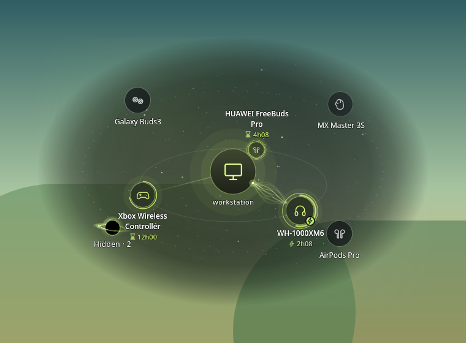 | 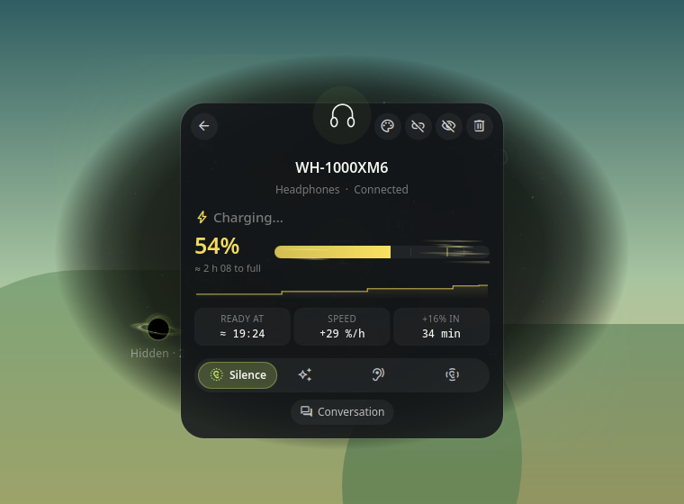 |

## The orbit

| Gesture | Result |
| --- | --- |
| Drag a device inside the inner ring | Magnet snap; release to pair and connect |
| Drag a connected device outward | Elastic tether; release to disconnect |
| Hover a connected device, click × | Disconnect (when *Quick disconnect button* is on) |
| Click a device | It flies onto a detail card |
| Right-click a device | Menu: connect or disconnect, noise-control modes, hide |
| Drag a device into the black hole | It is swallowed and hidden (it stays connected) |
| Click the black hole | List of hidden devices, with **Show** to bring one back |
| Click the center, or the **Scan** chip | Start discovery |
| <kbd>Esc</kbd>, click outside, or <kbd>←</kbd> | Step back: menu, hidden list, then detail card |

Connected devices orbit on the inner ring, drawn 15 % smaller so the ring stays airy; the others float in the outer field. While a connection is being made, a small comet circles the device and sonar rings leave it. Named devices are ranked before devices that only expose a MAC address.

**Example: connecting new headphones.**

1. Put the headphones in pairing mode.
2. Open the orbit. Discovery starts on its own (click **Scan** if *Scan automatically* is off).
3. The headphones appear in the outer field. Drag them toward the center: the ring lights up and pulls them in.
4. Release. They pair, connect and settle on the inner ring with their battery arc.


## The detail card

Click any device to open it: its glyph flies onto the card.

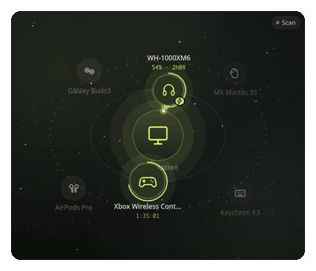

- **Name, type and state** (connected, paired, available).
- **Rename**: click the name of a paired device. <kbd>Enter</kbd> saves, <kbd>Esc</kbd> cancels, an empty name restores the device's own name. The new name is the Bluetooth alias, so every app shows it; icon, noise control and battery estimates still follow the device's own name.
- **Connection time and battery level.**
- **Volume** of audio devices: a slider and a mute button on the device's PipeWire output (hidden for devices with no sound output).
- **Actions**: change icon, connect or disconnect, hide, forget (asks twice).
- **Battery gauge, session chart and stats** (see [Charging and battery](#charging-and-battery)).
- The **earbuds trio** and **noise control** when the device supports them.

## Earbuds: the trio

Earbuds that report their parts (case, left, right) get a small orbit of their own in the detail card: the case in the middle, one bud at each end, each with its battery bar. A bud charging in the case moves closer to it, and field lines join the case to the bud.

| Earbuds trio | Buds charging in their case |
| --- | --- |
| 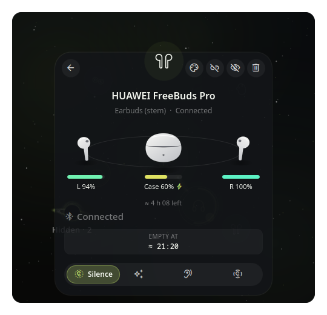 | 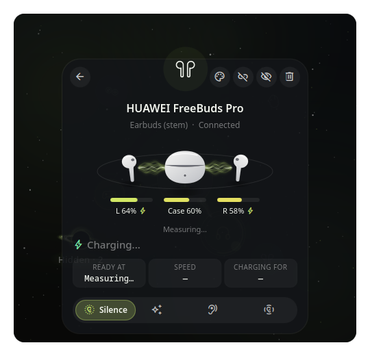 |

The drawings are chosen by name (stem or pebble buds; tall, wide or pebble case; white or graphite). To use your own photos, put them in the **Custom images folder** as `<name> case.png`, `<name> left.png` and `<name> right.png` (the left picture is mirrored when there is no right one).

## Hiding devices: the black hole

A small black hole drifts in the outer field. Drag a device you never use into it (or right-click it and pick **Hide**): it disappears from the orbit and the bar, but **stays connected**. Click the black hole to list what it holds and **Show** to bring a device back.

| Hidden devices | Right-click menu |
| --- | --- |
| 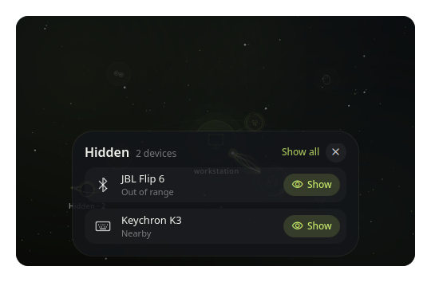 | 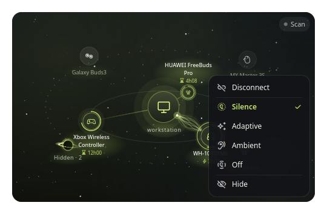 |

Two looks, in **Look → Black hole**:

- **Black hole** (default): a realistic one in the spirit of *Interstellar*, with an accretion disk and a photon ring, tinted by your theme.
- **Three-dimensional shadow of a four-dimensional bubble**: a wireframe tesseract (a nod to *Adventure Time*).

It bends the starfield like a gravitational lens, except on the desktop widget, whose sky is see-through.

## Noise control

Supported headphones get a mode selector in their detail card, a halo in the orbit (solid: cancelling, dotted: ambient) and the modes in their right-click menu. Only what the model supports is shown: noise cancelling, adaptive, ambient and off, the ambient level, voice focus, conversation detection and the left/right/case batteries.

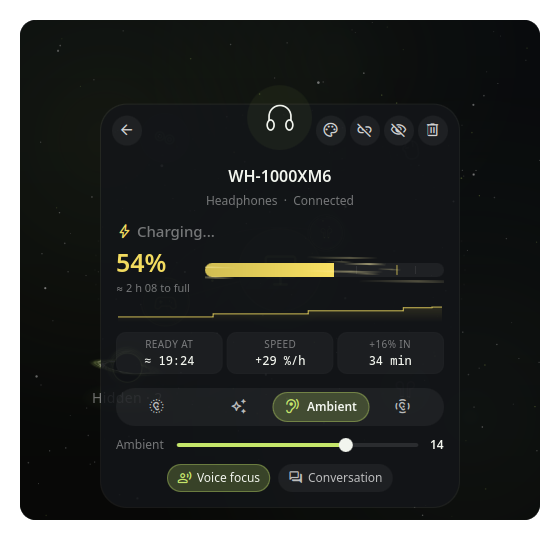

### Supported models

| Brand | Models | Tested on hardware |
| --- | --- | --- |
| Sony | WH-1000XM3 to XM6, WF-1000XM3 to XM5, LinkBuds, WH-CH720N, ULT WEAR… | Yes (WH-1000XM6) |
| Apple | AirPods Pro, AirPods 3 and 4, AirPods Max, Beats with noise control | Yes (AirPods 3 and 4); **AirPods Max: noise control is not functional** (AirPods Max 2 does not answer) |
| Samsung | Galaxy Buds, Buds+, Live, Pro, Buds2 to Buds4 (Pro, FE, Core) | No |
| Bose | QC35 / QC35 II, NC700, QC45, QC Ultra, QC Headphones | No |
| Nothing / CMF | Ear (1), (2), (3), (a), Headphone (1), CMF Buds and Headphone Pro | Ear (2) |
| Anker Soundcore | Life Q30/Q35, Liberty Air 2 Pro, Space Q45, others with the common layout | No |
| Huawei / Honor | FreeBuds 4i to 6i, Pro to Pro 5, SE 4, Studio, FreeLace Pro, FreeClip, Honor Earbuds 2 | Yes (FreeBuds Pro) |
| Oppo / OnePlus / realme | realme Buds T200 and Air6 Pro; other Enco/realme/OnePlus models are probed | No |
| Xiaomi | Redmi Buds 3 Pro, 4 Active, 5 Pro, 6 (Pro, Lite, Active), 8 Active | No |
| EarFun | Air Pro 4, Air S, Free Pro 3 | No |
| Moondrop | Space Travel 2, Space Travel 2 Ultra | No |
| Haylou | S35 ANC (mode can be set, not read) | No |
| 1MORE | SonoFlow, SonoFlow SE | No |

Untested brands follow their protocol documentation byte for byte and are covered by unit tests. If yours does not answer, it simply shows no noise control; reports are welcome. **Not supported** (no reliable public documentation): Jabra, JBL, Sennheiser, Marshall, Google Pixel Buds.

### How it works

QML cannot open a Bluetooth socket, so a small helper (`anc/orbit_anc.py`, Python standard library only) talks to the headset. The **Engine** setting decides when it runs:

- **On demand** (default): only while an Orbit view is open, or for the second it takes to apply a command. Nothing runs once the view is closed.
- **Always connected**: one session per connected headset, so changes made with the headset's own buttons show up live (a small idle process).

Noise control only talks to **paired** headsets: opening a channel to a device that is connected but not paired would make it drop and reconnect. Some headsets cannot report every mode (the WH-1000XM6 reads "noise cancelling" and "off" the same way); Orbit then keeps the last mode it set or saw.

**Conversation awareness** (the *Conversation* chip) cannot be turned off once the headset is disconnected, so a headset could stay stuck in conversation mode. When you disconnect a headset from Orbit (drag away, menu, × button), Orbit first turns conversation awareness off, then disconnects (at most 4 s of waiting). It does the same about 2.5 s after any reconnection, which covers a headset switched off, out of range or disconnected from another app. The noise-control mode (noise cancelling, ambient, off) is never changed. Switch it off with **Headphones → Turn off conversation awareness on disconnect**; Orbit then never changes it by itself.

**AirPods Max (including the Max 2): noise control does not work yet.** The headset does not answer the way AirPods 3 and 4 do. Orbit asks twice, then offers off / noise cancelling / ambient anyway (commands are sent blind), but this is unverified and may do nothing. To help decode it, run the shell with `ORBIT_ANC_DEBUG=1` and open an issue with the packets.

## Charging and battery

A charging device gets a lightning badge, a breathing battery arc and a beam of energy from your machine, drawn as magnetic field lines. Under its name you read the level and the time to full, for example `54% · 2h08`.

| Charging in orbit | Charging details |
| --- | --- |
| 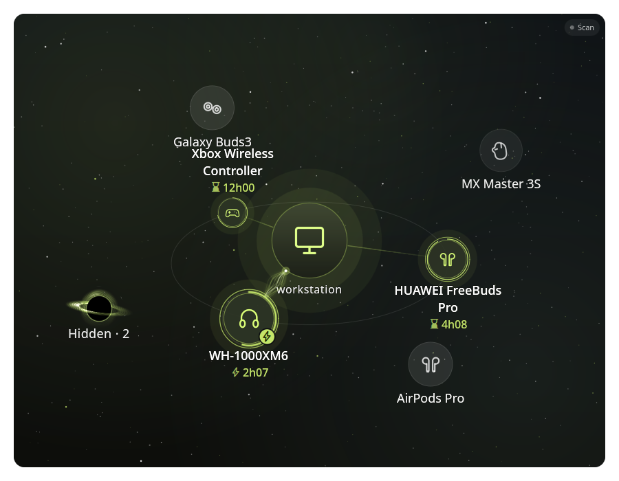 | 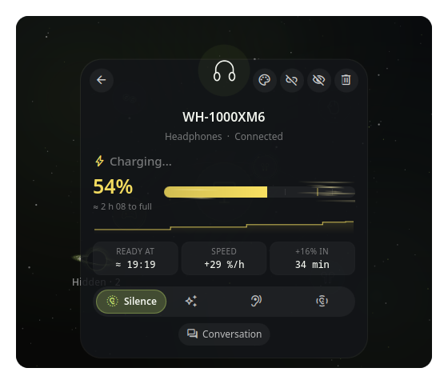 |

| Field | Example | Meaning |
| --- | --- | --- |
| Readout | `54%  ≈ 2 h 08 to full` | Level and time to full |
| **READY AT** | `≈ 15:45` | Clock time when it should be full |
| **SPEED** or **POWER** | `+29 %/h` or `4.5 W` | Charge rate (power when the device reports it) |
| **+16% IN** | `34 min` | Gained during this charge, and for how long |
| **HEALTH** | `92%` | Battery health, when reported |
| Chart | Step line | Level over the current connection |

When not charging, the readout shows the time left and the tiles switch to **EMPTY AT** and **DRAIN**. The gauge is colored by level (red → amber → gold → lime → aqua), with a mark at 80 %.

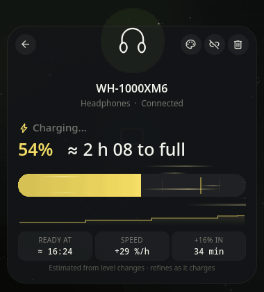

**Where the numbers come from.** Bluetooth only reports a percentage, so Orbit combines two sources; the card's footnote says which one is in use.

1. **Reported by the device.** Headsets with noise control report their charging state through the helper. Devices with a kernel battery driver (game controllers, Logitech peripherals…) publish it through UPower, matched to their Bluetooth address via `HID_UNIQ` in sysfs.
2. **Estimated from level changes.** Otherwise charging is inferred from a rising level, accounting for the usual slowdown past 80 %. Estimates are shown with `≈`, appear after a few minutes and refine over time.

## New headphones pop-up


Switch on new headphones, earbuds or a speaker and put them in pairing mode: within about a minute a card drops from the top of the screen, under the bar, even with every Orbit view closed. The device falls out of the bar into a small orbit and sends sonar rings while it waits.

- **Connect** pairs and connects it right there (accept the code in DMS's pairing dialog if the device asks), then shows its battery and closes.
- **Later** closes it; the same device is not offered again for 10 minutes. No answer within 20 s counts as *Later*; the line at the bottom shows the time left and stops while the pointer is over the card.
- **Ignore** never offers that device again. **Offer ignored devices again** (end of the settings) clears the list.

**What is offered**: only named, unpaired audio devices (headphones, earbuds, speakers) found by discovery, so the neighbours' phones and TVs never pop up. Devices BlueZ already knew when the shell started wait 10 minutes before they can be offered.

**When it stays quiet**: no pop-up while a window is full screen (it waits, then shows), or while the screen is locked or off. On the screen of the active window; with *Reduce motion* it simply fades in.

**The background scan** runs for 8 s every minute (**Background scan**: 30 s to 5 min), and only when it is harmless:

- Bluetooth on, screen on and unlocked;
- no Bluetooth audio device connected: discovery shares the radio with the audio link and makes music stutter on many adapters, so while you listen it waits;
- on battery, only above **No background scan below** (30 % by default); plugged in, always;
- not while an Orbit view is already scanning (the pop-up uses that scan, and never stops it).

With **Real device pictures** on, the card shows the headset's picture and its halo takes the picture's colour. That means the model name of an *unpaired* audio device is looked up too, under the same rules as below.

To see it without new headphones: `dms ipc call orbitBluetooth newDeviceDemo` (a made-up headset; *Connect* plays the pairing, nothing is paired). `dms ipc call orbitBluetooth newDeviceStatus` says whether the last background scan ran, or why it was skipped.

Turn it all off with **Scanning → Pop-up for new headphones**; Orbit then only finds devices while a view is open, as before. While it is on, the small *Connect* card inside the orbit is replaced by the pop-up.

## Real device pictures

Off by default, because it is the one feature that uses the internet. Turn it on in **Settings → Device pictures**: the icon of a paired or connected device is replaced by a photo of the model, cropped to a disc.

- **What is sent**: only the model name, for example `WH-1000XM6`. Never the Bluetooth address, never the name of your machine, never devices you only see while scanning, except audio devices the [new headphones pop-up](#new-headphones-pop-up) offers you. Names that look personal (`Marie's iPhone`, `iPhone de Marie`) or that are only an address are skipped.
- **Where it goes**, in this order, stopping at the first match: `commons.wikimedia.org` (real photos, the picture comes from `upload.wikimedia.org`), then `api.sketchfab.com` (previews of 3D models, from `media.sketchfab.com`).
- **Licenses**: only CC0, CC BY, CC BY-SA and public domain. The title, author and license appear under the detail card.
- **Accuracy**: a result counts only when its title contains the model name, so a missing picture is more likely than a wrong one. Very recent models may have none yet; the icon stays.
- **Cache**: each model is looked up once and kept in `~/.cache/orbitBluetooth/pictures` (a model with no result is retried after a week). **Delete downloaded pictures** empties it.
- Your own **Custom images folder** always wins over a downloaded picture.

Not tested against the live services yet: the lookup logic is covered by unit tests with sample answers.

## Device icons

Icons are matched by name patterns (`WH-1000XMx`, `AirPods Max`, `MX Master`, `Galaxy Buds`, `DualSense`…). The BlueZ device class breaks ties, so a `G733` headset is never drawn as a mouse.

- **Change one**: open its detail card and click the palette button. **Reset device icons** in the settings clears all choices.
- **Use your own artwork**: set **Custom images folder** and add PNGs named after each device's own name. Characters not allowed in file names (`/ \ : * ? " < > |`) become `_`.

```
~/Pictures/bluetooth/
├── WH-1000XM6.png
├── Xbox Wireless Controller.png
└── MX Master 3S.png
```

## Light theme

Orbit keeps its night sky in every theme. With a light DMS theme, devices turn into white discs, cards into a soft off-white, and accents are lifted so they stay readable.

| Orbit, light theme | Detail card, light theme |
| --- | --- |
| 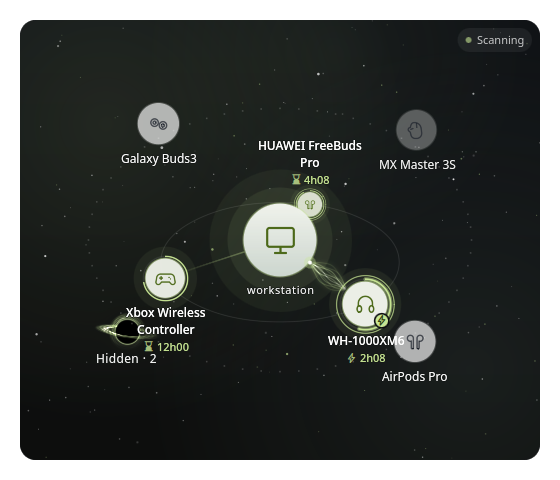 | 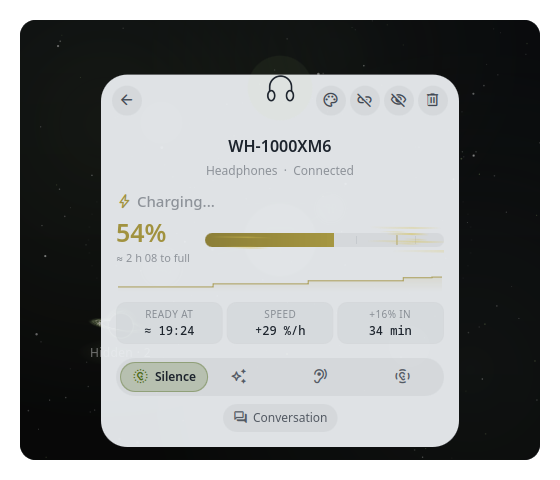 |

## Settings

| Section | Setting | Default | Description |
| --- | --- | --- | --- |
| Orbit | Devices in orbit | 8 | Connected devices always show; the rest are ranked by pairing and name |
| | Always show names | On | Otherwise names appear on hover |
| | Show unnamed devices | Off | Devices that only expose a MAC address |
| | Quick disconnect button | Off | An × on connected devices, on hover |
| | Center device | Automatic | Icon of this machine (laptop or desktop is detected) |
| Scanning | Scan automatically | On | Start discovery when a view opens; otherwise click the center |
| | Offer new devices | On | A card with *Connect* when an unpaired device shows up while scanning |
| | Pop-up for new headphones | On | Background scan and a pop-up under the bar, see [New headphones pop-up](#new-headphones-pop-up) ⚡ |
| | Background scan | Every minute | 30 s, 1, 2 or 5 min; 8 s each time |
| | No background scan below | 30 % | Battery of this computer, when unplugged |
| | Scan duration | 45 s | 20 s, 45 s, 90 s or *While open* ⚡ |
| Headphones | Noise control | On | Supported headphones (needs Python 3) |
| | Turn off conversation awareness on disconnect | On | Turns *Conversation* off before Orbit disconnects a headset, and after it reconnects |
| | Engine | On demand | *Always connected* ⚡ shows headset button presses live |
| Desktop widget | Displays | All | Which displays show the desktop widget |
| | Backdrop | 72 % | Depth of the veil behind the orbit |
| | Ambient motion | Off | Keep orbits moving when the pointer is away ⚡ |
| Device pictures | Real device pictures (uses the internet) | Off | Photo of the model instead of an icon, see [Real device pictures](#real-device-pictures) |
| Look | Black hole | Black hole | Realistic, or the tesseract |
| | Shooting stars | On | A rare meteor (every 12–32 s), bent or swallowed by the black hole |
| | Stars | Normal | Low, Normal or High |
| | Custom images folder | — | PNG files that replace built-in icons |
| Sounds | Sounds | Off | Short cues on snap, connect and disconnect |
| | Volume | 60 % | |

Three buttons at the end reset custom device icons, bring back every hidden device and offer ignored devices again. DMS's *Reduce motion* is respected.

## Privacy

- **No telemetry. No network access, except one opt-in feature, off by default**: [Real device pictures](#real-device-pictures), which sends only the model name of paired devices to `commons.wikimedia.org` and `api.sketchfab.com`.
- **Background scan** (the new headphones pop-up, on by default): Bluetooth discovery for 8 s about once a minute, local only, under the conditions in [New headphones pop-up](#new-headphones-pop-up). Devices you *Ignore* are stored with the plugin settings.
- **The volume slider** talks to the local sound server (PipeWire) only.
- **One helper process**: the noise-control helper opens a local Bluetooth socket to your headset and nothing else, only while needed. `ORBIT_ANC_DEBUG=1` prints its raw packets on stderr; nothing is logged to a file.
- **Nothing written to disk by Orbit**, except the pictures cache of that opt-in feature (`~/.cache/orbitBluetooth/pictures`): connection times and battery history live in memory for the session.
- **Files read**: only the sysfs `uevent` of kernel batteries, once each.
- **Settings** (choices, custom icons, hidden devices) are stored by DMS with your other plugin settings.
- **Device names** you set are stored by BlueZ, like any Bluetooth alias.

## Performance

Orbit costs nothing while you are not looking at it: no frames at rest, nothing running while views are closed (except the pop-up's short background scan, which you can turn off), everything paused while the session is locked. CPU of the whole shell (% of one core, 240 Hz screen, DMS alone: 0.7 %):

| State | 1.4.1 |
| --- | --- |
| Idle (bar icon, view closed) | 0.5 |
| View open, left alone | 3.8 |
| View open while scanning | 5.2 |
| Desktop widget, *Ambient motion* on | 9.2 |

How this is achieved, and earlier measurements, are in [CONTRIBUTING.md](../CONTRIBUTING.md#performance-rules).
