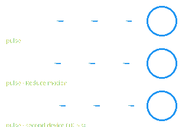
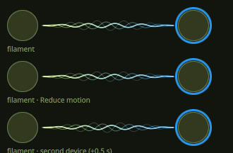
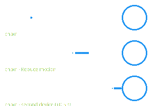
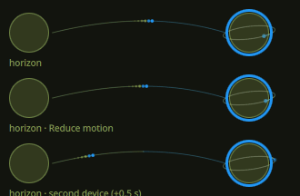

# Orbit Bluetooth: user guide

Everything Orbit Bluetooth can do, in detail. To install it and add a widget, see the [README](../README.md#getting-started).

## Contents

- [Widgets](#widgets)
- [The orbit](#the-orbit) · [If it does not connect](#if-it-does-not-connect) · [If it does not disconnect](#if-it-does-not-disconnect) · [Bluetooth is off](#bluetooth-is-off)
- [The detail card](#the-detail-card)
- [Long press](#long-press)
- [The two volumes](#the-two-volumes) · [Separate PC volume](#separate-pc-volume) · [Orbit's tick only](#orbits-tick-only) · [Volume pop-up](#volume-pop-up) · [Smart volume steps](#smart-volume-steps) · [Volume keys](#volume-keys) · [What really plays](#what-really-plays)
- [Listen together](#listen-together) · [Create a group from the menu](#create-a-group-from-the-menu) · [Suggested groups](#suggested-groups) · [Learn my groups](#learn-my-groups) · [Forget what Orbit learned](#forget-what-orbit-learned) · [The source at the center](#the-source-at-the-center) · [Group icons](#group-icons) · [The volume at the center](#the-volume-at-the-center) · [Wired outputs](#wired-outputs) · [Wired outputs in the group](#wired-outputs-in-the-group) · [Pull a wired output out of the group](#pull-a-wired-output-out-of-the-group) · [Wired delay](#wired-delay) · [What it costs](#what-it-costs) · [Limits](#limits) · [Works with multipoint headsets](#works-with-multipoint-headsets) · [Two outputs, one radio](#two-outputs-one-radio)
- [Earbuds: the trio](#earbuds-the-trio)
- [Hiding devices: the black hole](#hiding-devices-the-black-hole)
- [Noise control](#noise-control) · [Pause when you take the headset off](#pause-when-you-take-the-headset-off) · [How long a conversation lasts](#how-long-a-conversation-lasts)
- [Charging and battery](#charging-and-battery) · [Battery arc colours](#battery-arc-colours) · [Charging beam](#charging-beam)
- [New headphones pop-up](#new-headphones-pop-up)
- [Pairing safety](#pairing-safety)
- [Real device pictures](#real-device-pictures)
- [Device icons](#device-icons)
- [Light theme](#light-theme)
- [Settings](#settings) · [Report a problem](#report-a-problem)
- [Privacy](#privacy)
- [Performance](#performance)

## Widgets

**Control Center.** Click the tile icon to turn Bluetooth on or off, the arrow to expand the orbit inline. The view stays compact and grows while a detail card is open, so the whole card fits.

**Bar.** Left click opens the orbit in a popout, right click turns Bluetooth on or off. Connected devices appear as tiny glyphs in the pill.

**Desktop.** A frameless orbit (default 440 × 380): a smoky veil tinted with your theme accent fades into the wallpaper. It stays frozen until the pointer is over it, and the detail card closes by itself when the pointer leaves. With *Ambient motion* on, the orbit keeps drifting, except behind windows: when they fill the screen (fullscreen, maximized or side by side), it freezes and costs nothing until the desktop shows again (niri).

| Desktop widget | Desktop widget, detail card |
| --- | --- |
|  |  |

## The orbit

| Gesture | Result |
| --- | --- |
| Drag a device inside the inner ring | Magnet snap; release to pair and connect |
| Drag a connected device outward | Elastic tether; release to disconnect |
| Hover a connected device, click × | Disconnect (when *Quick disconnect button* is on) |
| Click a device | It flies onto a detail card |
| Right-click a device | Menu: connect or disconnect, noise-control modes, hide |
| Drag a device into the black hole | It is swallowed and hidden (it stays connected) |
| Click the black hole | List of hidden devices, with **Show** to bring one back |
| Click the center, or the **Scan** chip | Start discovery |
| <kbd>Esc</kbd>, click outside, or <kbd>←</kbd> | Step back: menu, hidden list, then detail card |

On the desktop widget the keyboard is on demand: <kbd>Esc</kbd> works while the pointer is over the widget or while a menu, a card or the hidden list is open, and the keyboard goes back to your window when the pointer leaves.

Connected devices orbit on the inner ring, drawn 15 % smaller so the ring stays airy; the others float in the outer field. While a connection is being made, a small comet circles the device and sonar rings leave it. Named devices are ranked before devices that only expose a MAC address.

**Example: connecting new headphones.**

1. Put the headphones in pairing mode.
2. Open the orbit. Discovery starts on its own (click **Scan** if *Scan automatically* is off).
3. The headphones appear in the outer field. Drag them toward the center: the ring lights up and pulls them in.
4. Release. They pair, connect and settle on the inner ring with their battery arc.


### If it does not connect

When a device you dragged in does not connect, it springs back out and a short note under the center says what happened, with the GitHub mark linking here:

- **Could not pair…** — the device did not answer or declined. Put it back in pairing mode (often a long press on its button, until a light blinks), keep it close, and drag it in again. If it was paired with another computer or phone, turn that one's Bluetooth off first.
- **…did not connect** — it is paired, but did not answer in 25 s. Check that it is on, charged and nearby; some earbuds only connect once out of their case.
- **…was not paired** — Orbit could not read what the device does, so it did not trust it. See [Pairing safety](#pairing-safety).

The note goes away by itself after a few seconds, or stays while the pointer is on it. From the command line, `dms ipc call orbitBluetooth …` replies that something cannot be done with the same link.

### If it does not disconnect

When you pull a device out and it is **still connected** 8 seconds later, it springs back to its place on the inner ring and the note says **…is still connected**. The device or BlueZ refused: it may be busy (a call, a file transfer). Try again, or turn the device off. Nothing is retried on its own.

### Bluetooth is off

When Bluetooth is off, the orbit is empty and the center says **Bluetooth is off**, with a **Turn on** button.


- If **Turn on** changes nothing within 3 seconds, a note says **Bluetooth stayed off**: something blocks it. Turn off airplane mode, check a Bluetooth switch or key on the laptop, or run `rfkill list` in a terminal: a *Soft blocked: yes* line is lifted with `rfkill unblock bluetooth`; *Hard blocked: yes* is the switch.
- **No Bluetooth adapter** means the computer has none the system can use: no Bluetooth chip, a USB dongle unplugged, or the `bluetooth` service stopped (`systemctl status bluetooth`). Orbit needs BlueZ and an adapter; see *Requirements* in the README.

## The detail card

Click any device to open it: its glyph flies onto the card.


- **Name, type and state** (connected, paired, available).
- **Rename**: click the name of a paired device. <kbd>Enter</kbd> saves, <kbd>Esc</kbd> cancels, an empty name restores the device's own name. The new name is the Bluetooth alias, so every app shows it; icon, noise control and battery estimates still follow the device's own name.
- **Connection time and battery level.**
- **Volume** of connected audio devices: the device's own level and this PC's, see [The two volumes](#the-two-volumes).
- **Actions**: on the left, back and change icon (the card); on the right, connect or disconnect, hide, forget (asks twice) (the device).
- **Forget** unpairs the device (BlueZ removes it) and clears what Orbit kept about it: its icon choice and a *Don't offer again* mark, so it can be offered as new next time. Also in the right-click menu: **Forget**, then click again to confirm.
- **Battery gauge, session chart and stats** (see [Charging and battery](#charging-and-battery)).
- The **earbuds trio** and **noise control** when the device supports them.

## Long press

A press held for half a second does what a right click does, so everything in the right-click menu is within reach without a right button, and on a touch screen. Hold the press on:

- a **device**: its menu opens (connect, noise control, create a group, hide…);
- a **wired output of a group** (the rounded square): its menu opens;
- the dotted **ghost planet** of a suggested group: it is turned down, as with a right click ([Suggested groups](#suggested-groups)).

A ring fills around the thing under your finger or pointer while you hold. Let go early and it is a plain click. Move more than 5 px and the hold is cancelled: a device is picked up for a drag as usual, so carrying one onto another to listen together is unchanged. When the menu opens, the release that follows is not a click. While a menu is open, any press closes it, as a right click does. It works in the bar's popout and in the Control Center, wherever right click does.

Nothing runs until you press: a 30 Hz timer lives only for the half second of the hold. Measured offscreen, holding in a loop costs +0.07 % of a core over no hold (within noise), far under the 2 % per-action budget.

## The two volumes

Open a **connected** audio device (headphones, speaker, earbuds, TV…) and its card shows **two volumes** on a small dark screen, the same one as Orbit's volume pop-up:


- **In the bar pop-out and the Control Center**, the two volumes start **folded into one thin line** (each level as a slim bar with its percentage), so the card fits without scrolling. The wheel over a level changes it (the device's on the left, this PC's on the right), with the same smart steps as the keys. Click it to unfold the screen; the ⌃ in its corner folds it back. Orbit remembers your choice until the shell restarts. Folded, the sound is not read at all. The desktop widget always shows the screen.
- **The outer half circle is the device's own level** (`primary` color), the one its buttons change. **The inner one is this PC's**: what the PC sends to it (`tertiary` color; when the theme's two accents look alike, such as a pink and a salmon, this PC takes the opposite hue, so the two never read as one). The icon at the foot of each says which is which, and the percentages stay next to them.
- **Inside, the sound itself**: where it goes, left or right, and how loud. Pick the style in the settings (*Points*, *Rays*, *Waves* or *None*). It only moves while the card is on screen and sound is playing.
- **Drag a moon** along its half circle for any level. **Scroll** for Orbit's smart steps (1 % per slow notch, bigger when you scroll fast): over a half circle, the icon at its foot or its percentage, the wheel changes **that** level, and the one you scroll lights up (its moon grows, its percentage shines). Nothing is a dead spot: between the half circles the nearer one takes the wheel, and with the percentages on either side of the screen the left one is the device's and the right one this PC's.
- **Click an icon** to mute that level. **Click the planet** to mute too: with one audio device connected it mutes this PC, with several it mutes that device only.
- **Scroll over the planet** to change the level you hear move first (the device's own when it has one).
- **A device with no level of its own** (no *absolute volume* over Bluetooth): its volume is this PC's, so the screen shows this PC's half circle alone and says *Its volume follows this PC*.
- **Volume tick**: a soft, short tick plays at each step you make (every 1 % by default, or every 5 %: **Scanning → Tick every**), one for each step crossed, so a fast change is a run of ticks (about 40 a second, 12 at most) and not a single one, so you hear the level where it matters: on the card, in the volume scope (the Dank Island or the pop-up), with the volume keys and in the [radar](#the-volume-radar). It plays **in the output whose level you change**, and only there, so turning one speaker does not make the whole room tick. When you change the **group's** level (the ring at the center, the group's arc, the radar's group dial) it plays in **every** output of the group at once. Turn it off in **Scanning → Volume tick**. It needs `pw-play` (part of PipeWire). DMS's own volume sound waits while you change a level in Orbit, so only the tick plays: see [Orbit's tick only](#orbits-tick-only).
- Devices that are not connected, or have no sound output, show no screen: scrolling over a connected keyboard or mouse says **…has no volume** instead of doing nothing. Right after a headset connects, its audio can take a second to appear.

Everything talks to the local sound server (PipeWire) only. The picture of the sound is read with `cava` from the device's output, only while the card is open; with *Reduce motion* it does not run and the levels change at once.

### Separate PC volume

Many Bluetooth devices have a volume of their own (*absolute volume*): the level their buttons change. Then there are two levels on the way to your ears, and Orbit keeps them apart:

- **The device's level** is the one the device shows and remembers.
- **This PC's level** is what the PC sends to it. Orbit remembers it **per device**, so your speaker can sit at 100 % from the PC while your headset stays at 40 %.
- To carry this PC's level, Orbit adds a small sound filter in front of the device. It belongs to the shell and disappears with it; nothing in your sound setup is changed.
- Turn it off in **Sound → Separate PC volume**: no filter, and every device shows one level, as before.

Devices that follow this PC's level have one level only, whatever this setting says.

### Orbit's tick only

DMS plays a sound of its own when a volume changes (*Settings → Sounds → Volume Changed*). Next to Orbit's [volume tick](#the-two-volumes) that is two sounds for one change, so Orbit asks DMS's to wait while it moves a level.

- **On by default**, in **Scanning → Orbit's tick only**. The row is shown only while **Volume tick** is on: without the tick, DMS's sound is the only one there is.
- **Only around Orbit's own changes.** DMS's sound waits from the moment Orbit writes a level (a drag on the card, the pop-up or the radar, a scroll, the volume keys you gave to Orbit, a command line call) until about 0.4 second after the last one. DMS's own sliders and keys, and anything else that changes a volume, keep their sound.
- **It is done in memory.** Orbit holds DMS's *Volume Changed* switch off, and DMS's own value comes back by itself 0.4 second later, when you turn the row off, when the plugin is turned off or when it is removed. Orbit writes nothing of DMS's, and nothing runs when no level moves.
- **DMS's saves are guarded**, as for [DMS's own volume OSD](#dmss-own-volume-osd): Orbit lets go of the switch for a quarter of a second around each save DMS makes, so the file keeps your own value and removing Orbit leaves nothing behind. In that moment DMS's sound could play along with the tick.
- **If DMS changes how it saves or renames the switch** (an update), Orbit cannot see the saves or the switch any more: it then leaves DMS's sound alone, or the file may take it as off. In the second case turn **Volume Changed** back on in DMS's *Settings → Sounds*, and please open an issue.
- Turn the row off to hear both sounds again.

## Volume pop-up

When a volume changes, from a key, the command line or anywhere else, Orbit can show **both levels at once** in a small pop-up: the same dark screen as the card, with the device's half circle, this PC's, and the sound inside.

- **Where** (**Sound → Pop-up**): *In the Dank Island* (the default), *Under the bar widget*, *Right screen edge*, or *Off* to keep DMS's own OSD.
- **Dank Island**: on screens that have one, Orbit's screen appears **inside the island**, which grows to fit. A screen without an island gets the pop-up where DMS's OSD would show.
- **Only one volume pop-up**: with any choice but *Off*, DMS's own volume OSD is switched off, see [DMS's own volume OSD](#dmss-own-volume-osd).
- **Screens** (**Sound → Screens**): *Where I am* (default) shows the pop-up only on the screen with the focus, and one still up on the screen you just left closes; *Every screen* shows it everywhere. If the focused screen is not one where the pop-up can show, it shows everywhere, never nowhere.
- **Size** (**Sound → Size**): *Compact*, *Medium* (default) or *Large*.
- **It grows out of the island** with DMS's own spring, and folds back by itself. How it moves is up to DMS: *Settings → Dank Island → Reduce Motion* (or the global *Reduce Motion*) makes it follow the keys at once, which costs much less shell time.
- **Scroll over it** to keep changing the level with [smart steps](#smart-volume-steps); drag a moon or click an icon, as on the card. It closes by itself a moment after the last change.
- **The info line starts folded** each time: the details you unfolded are not kept for the next pop-up.
- With no Bluetooth audio device, it shows this PC's level alone.

### DMS's own volume OSD

So that only one volume pop-up shows, Orbit switches DMS's own volume OSD off while its pop-up is on (any choice but *Off*). That also stops DMS's Dank Island from opening its own volume face before Orbit's.

- It is done **in memory**: Orbit holds DMS's *Volume* switch (*Settings → On-screen Displays*) off, and DMS's own value comes back when Orbit stops, when the plugin is turned off, or when you choose *Off*. Orbit writes nothing of DMS's.
- **DMS's saves are guarded.** DMS saves all of its settings together whenever one changes (a theme, a bar...) and once when it starts. Orbit lets go of the switch for a quarter of a second around each save, so the file keeps your own *Volume* value and removing Orbit leaves nothing behind. In that quarter of a second DMS's OSD could show if you press a volume key.
- **If DMS changes how it saves** (an update that renames the flag Orbit watches), Orbit cannot see the saves any more and the file may take the switch as off. Then turn **Volume** back on in DMS's *Settings → On-screen Displays*, and please open an issue.
- The microphone, brightness and other OSDs are not touched.

The sound inside is drawn only while the pop-up or a card shows:

- **Visualizer** (**Sound → Visualizer**): *Points* (a cloud: where the sound sits, left or right), *Rays* or *Waves* (its notes, bass at the top), or *None*.
- **Visualizer motion**: *Light* (30 images per second, the default) or *Smooth* (60, twice the work).
- It needs `cava`; without it, PipeWire's own peak meter draws one band per side. With *Reduce motion*, nothing moves.

## Smart volume steps

Orbit's own way of stepping the volume, for the wheel over the pop-up and the card and for the [volume keys](#volume-keys) once bound to Orbit:

- **Slow notches move by 1 %**, so you can land exactly where you want.
- **A quick run builds up speed**, up to a ceiling you choose in **Sound → Speed-up**: *Gentle* (3 %), *Balanced* (4 %, default) or *Fast* (6 %).
- **Turning back** to look for a spot holds the step small for a moment.
- Under 10 %, every step is 1 %.
- **The keys change the output you hear**, Bluetooth or not: with the sound on a wired interface and a headset connected, the interface moves and the headset stays where it is.
- **Sound → Steps → Fixed** gives the same step every time instead (**Step**, 5 % by default).
- From the command line: `dms ipc call orbitBluetooth volume up` or `down` (smart steps on the device you hear), `deviceVolume` and `pcVolume` for one level: `up` or `down` (5 %), `N` for a level from 0 to 100, `+N` or `-N` for a step (a negative one needs `--`: `pcVolume -- -10`).

## Volume keys

Your keyboard's volume keys can use Orbit's **smart steps**: 1 % per press when you tap, bigger steps when you hold or press fast, the same as scrolling in Orbit's volume pop-up.

- **The first time** Orbit's volume pop-up opens, one line under the scope offers it: **Smart volume keys? Enable**. Click **Enable** and the line reads **Smart volume keys on · Undo**. It shows only once; nothing changes unless you click.
- **In the settings**, **Sound** tab, under the volume steps: **Use smart steps** binds them, **Give back to DMS** undoes it. The line next to it says what the keys do now.
- **From the command line**: `dms ipc call orbitBluetooth volumeKeys on`, `off` or `status`.

How it works:

- Orbit asks DMS's own command, `dms keybinds`, to point the two keys (`XF86AudioRaiseVolume` and `XF86AudioLowerVolume`) at Orbit. Orbit writes nothing itself; this is the one DMS setting it changes, and only when you click.
- It binds them only if they still do **DMS's default** (`dms ipc call audio increment` and `decrement`). If you bound them to something of your own, Orbit leaves them alone.
- **The keys never stop working.** If Orbit is off, removed, or too old for this command, the keys fall back to DMS's own step (the one they had, 3 % by default).
- **Undo**, **Give back to DMS** and **uninstalling Orbit** write back the exact line DMS had, only on keys still bound to Orbit.
- **niri only**: elsewhere the line reads *Bind your keys to Orbit*. Bind them yourself, for example in Hyprland: `binde = , XF86AudioRaiseVolume, exec, dms ipc call orbitBluetooth volume up`.

### Which level the keys move

With a [Listen together](#listen-together) group playing, the keys (and `dms ipc call orbitBluetooth volume up|down`) move **the last member whose own level you touched**: in the volume scope, on the radar or with the wheel over its planet. Touch the group's level, or close the volume pop-up, and they go back to the group. They also go back to the group when the group ends, when that member leaves, or when it has no level of its own (a device that follows this PC). Without a group nothing changes: the keys move the output you hear.

The member the keys move is **visible**: in the volume scope its arc has a firmer track and a brighter glow. When no arc is marked, the keys move the group. The tick follows the same target: it plays in the output of the member whose level moved, or in every member's when the group's level moves.

## What really plays

Under the device's name on its card, and at the foot of the volume pop-up (centered under the screen, for **any** output: a sound card, HDMI, a Bluetooth device), one short line says what the sound is:

> Bluetooth · LDAC · 96 kHz · 24 bit

- **Connection**: *Bluetooth*, *USB*, *HDMI*, *S/PDIF* (optical or coaxial) or *Analog*.
- **Codec**: for Bluetooth, the one in use (SBC, SBC-XQ, AAC, aptX, aptX HD, aptX Adaptive, LDAC, LC3...). Wired outputs have none.
- **Sample rate and bit depth**: what PipeWire plays. For Bluetooth the depth is the codec's (24 bit for LDAC, 16 for SBC); for a wired output it is the format PipeWire sends to the card.
- **The info button** next to the line unfolds the details: the same facts with their names, the **profile**, **bit rate**, **channels**, **latency**, **quantum**, and **PC to device**, a note such as *Resampled 48 kHz to 96 kHz* when this PC mixes at one rate and the device plays at another (it appears only for a device with the [separate PC volume](#separate-pc-volume)).
- **Choose what shows**: **Settings → Sound → Audio details** has two switches per fact, *on the line* and *more info*. Turn every one off and Orbit reads nothing.

It is read from PipeWire (`pactl list sinks`) once when the card or pop-up appears, and again when you click the info button; the graph facts (bit rate, latency, quantum) are read only while the details are unfolded, or while their *on the line* switch is on. Nothing runs while they are closed, and nothing is sent anywhere. If the line is missing, the output is not known to PipeWire yet (a headset takes a second to appear after it connects) or `pactl` is not installed (it comes with `pipewire-pulse`).

### Profile

The Bluetooth profile the headset is in, as BlueZ reports it: *A2DP* (stereo music, the one you want to listen to) or *HSP/HFP* (a call, with a microphone and a poor sound). Wired outputs have none. If a headset sits in *HSP/HFP* while you play music, switch it back to *A2DP* in your sound settings.

### Bit rate

The rate the Bluetooth codec sends, in kilobits per second, for the codecs where it is **known** and not guessed:

> 990 kbps

- **LDAC**: 990, 660 or 330 kbps at 48 or 96 kHz (909, 606 or 303 at 44.1 or 88.2 kHz), the quality PipeWire is set to. When it is on *Auto*, Orbit shows the range (*Adaptive, 330 to 990 kbps*), because the real rate moves with the radio and nothing on the PC tells which one you have.
- **aptX** and **aptX HD**: always four to one, so Orbit computes it from the sample rate and channels (352 kbps for aptX at 44.1 kHz stereo, 576 for aptX HD at 48 kHz).
- **SBC, SBC-XQ, AAC and the rest**: no line. Their rate is chosen by the headset and is not published, so Orbit shows nothing rather than a number it would have made up.

### Latency

The delay PipeWire adds to the Bluetooth device, as the sound server reports it (*185 ms*). It is the part the PC knows about (the codec's buffer); the headset adds its own delay that no PC can read. It matters for films: a high value means lips and voices drift apart, and most players have an audio-delay setting to fix it. Wired outputs show nothing.

### Quantum

The size of the audio buffer PipeWire works in, in samples and milliseconds (*1024 samples (11 ms)*). A smaller quantum answers faster and costs more power. It is read from `pw-top`, which only lists outputs that are playing **right now**: pause the sound and the line is empty.

All four are read through `pw-dump` and `pw-top` (they come with PipeWire), only when you unfold the details or switch the fact on for the line, once per opening, and then Orbit lets go. If `pw-dump` or `pw-top` is not installed, only these lines go missing.

## Listen together

The same sound on **two, three or four** outputs at once, Bluetooth or [wired](#wired-outputs): the headset **and** the receiver, two speakers, two pairs of headphones for one film, a Bluetooth headset next to a USB audio interface.

- **Start**: in the orbit, **drag one connected audio device onto another** (or [create a group from the menu](#create-a-group-from-the-menu), or click a [suggested group](#suggested-groups)). As soon as you carry it, a soft halo breathes around each device it could join and a thread of light runs toward the nearest, brighter as they come closer, so you can see it can be done. The zone that takes the drop is **twice the target's radius** around its center (60 px at least), so a small planet far in the ring is as easy to hit as a big one. While it is over that zone, the thread is whole and the hint under the orbit reads *Release to listen together*; let go and both play the same sound. Pulled away from the ring, the invitation fades (that is the gesture to disconnect). With *Reduce motion* the halos and the light dots stand still. The dragged device springs back to its place, so you can see nothing moved.
- **Add one more**: drag another connected device onto **any** device that already listens together. Up to **4** outputs; at the fourth, a short note says so and links here.
- **One leaves**: right-click a device that listens together and choose **Remove from group** (a wired member reads **Disconnect**: it leaves the group and stays plugged in); the others keep playing. Dragging it outward, away from the group, does the same without disconnecting it (the hint reads *Release to leave the group*); a wired member can be dragged out too, see [Pull a wired output out of the group](#pull-a-wired-output-out-of-the-group). Turning it off ends its part too. With only two, removing one ends the session, since one device is not a group.
- **Stop it all**: **Stop group** in the group's [radar](#the-volume-radar), or `dms ipc call orbitBluetooth separate`. A member's menu is short on purpose: it leaves the group or hides, the group itself is stopped from its radar. A session also ends **by itself** when fewer than two outputs remain, and when the shell ends (a crash included).
- **On the command line** (one argument per call, so the list is quoted): `dms ipc call orbitBluetooth together "AA:BB:CC:DD:EE:01 AA:BB:CC:DD:EE:02 AA:BB:CC:DD:EE:03"` (spaces or commas), then `togetherAdd <address>`, `togetherRemove <address>`, `togetherStatus` (who listens together, as JSON), `togetherDelay <address> <ms>` (see [Limits](#limits)) and `separate`. Only connected audio devices are accepted, and a refusal says why.
- **What you see**: while a session runs, the [two volumes](#the-two-volumes) of the card and of the pop-up change shape. The outer half circle shows the **outputs' own levels**, the inner half circle stays below, shared: **this PC's level**, what the PC sends to all of them. Without a session, the screen looks as before.
  - **With two outputs**, the outer half circle is **cut at the top**: the left half is the first output (`primary` color), the right half the second (`secondary`), each lit from its bottom corner toward the top, and both meet at the top at 100 %. Each half has its own moon, icon and percentage, and its own cloud of points (or rays, or waves), so the sound's left and right show on the output that plays it.
  - **With three or four outputs**, the outer half circle is split into **equal arcs**, one per output, each lit from its bottom end toward the top (the arcs left of the middle from the left foot, those right of it from the right foot, so neighbours meet at the top at 100 %). Each arc has its own theme color, moon and icon, and the cloud of points is split into one sector per arc. Icons alone cannot tell two speakers apart, so each arc's **name and level** are written outside it; a long name is shortened, never the percentage.
  - **Colors** come from your theme: the outputs take `primary`, `secondary` and `tertiary` in turn, and this PC's half circle takes `tertiary`. When two would look alike (two pinks, a grey accent), one is turned to the hue farthest from the others, keeping its own saturation and lightness, so no two arcs read as one. With three or more outputs `tertiary` is already an arc, so this PC's color is the one turned.
  - The inner half circle (this PC's level) keeps its place and size.
- **Which sound is copied**: the one you hear. If one of the outputs is your current output, its sound is copied to all the others; otherwise the first one in the session. Orbit never changes your default output. If you later make another member your output, the copies follow it a moment after.
- **Each level is its own**: every output keeps its own volume (its buttons), and this PC's level reaches them all. Moving this PC's level moves it for **every** output that has Orbit's [separate PC volume](#separate-pc-volume); when a device joins, its PC level is set to the one the session has. Each such output keeps that last level afterwards, as the PC level of a device always is. An output with no filter of its own (a device that follows this PC's level) keeps **its own** level: Orbit never writes the volume that PipeWire remembers for a device.

### Create a group from the menu

You do not have to drag one device onto another: **right-click a connected output** (headphones, a speaker, a USB or HDMI output) and choose **Create a group…**. A checklist opens on the sky:

- **Wired** lists the outputs that are really plugged in right now (USB, HDMI, a jack with something in it). An unplugged jack is not there. They are read once, when the list opens.
- **Bluetooth** lists the devices that are connected and can play sound.
- The device you right-clicked is already ticked. Tick the others and press **Listen together**. Up to four outputs listen together.

When a group already listens, the entry reads **Add to the group…**: the members are shown with *In the group*, tick the newcomers and press **Add**. A device that is already in the group has no such entry on its menu (it cannot add itself): **Add a device…** is in the group's [radar](#the-volume-radar), and opens the same list with nothing ticked, tick the outputs to bring in.

A row you cannot tick stays in the list, faint, with the reason at its end. Click it and a short note says what to do (with a link back to this page):

| Written on the row | Why | What to do |
|---|---|---|
| *No sound yet* | The device is connected but has no sound output yet: it does not play sound, or its audio is not ready | Wait a moment, see [Works with multipoint headsets](#works-with-multipoint-headsets) |
| *Call mode* | A headset on its call profile plays mono | Switch it back to music first |
| *In the group* | It already listens together | Tick the ones to add |
| *Group is full* | Four outputs is the most | Untick one, or let a member leave |

Pressing the button with fewer than two outputs ticked (or nothing to add) says *Tick another output*. Nothing is refused in silence, and the list stays open so that you can change what is ticked.

Keys: **↑ / ↓** move along the rows, **Space** ticks or unticks, **Enter** is the button, **Escape** closes, **H** hides the output under the cursor (or brings it back from the *Hidden* section), **Right** and **Left** open and fold that section (see [Hiding devices](#hiding-devices-the-black-hole)). With *Reduce motion* on, the list simply appears. If the list is longer than the room it has (a small tile), it scrolls, and a thin mark on its right edge shows where you are.

- **If the wired section is missing**, plug the cable in first and open the list again: it is read when it opens, not while it is open.
- **What it reads**: the wired outputs, once, with PipeWire's own tool (`pactl --format=json list sinks`, a fixed command), only while the list is open. Nothing is stored and nothing is sent. Only the devices on the sky are offered in the lists: one you hid waits in the *Hidden* section at the bottom, which opens by itself the first time and then stays as you left it.
- **Not yet tried on real hardware**: the checks used made-up outputs, so the real click-through and the real Escape are still to be seen.

### Suggested groups

When two kinds of outputs are available at once (your sound goes to a **wired output**, a jack, USB or HDMI audio, and at least one **Bluetooth audio device** is connected, or the sound goes to a **Bluetooth device** and at least one **wired output** is plugged in; or all the outputs of a group you often listen to are there, whatever their kind), Orbit shows a **ghost planet** on this computer's ring: a dotted, translucent disc as big as the real group would be, with the icons of the outputs it would put together under it (hover them to read the names, see [Group icons](#group-icons)).

- **What it contains.** The group you listen to most, when all its members are there: Orbit learns it from your Listen together sessions (see [Learn my groups](#learn-my-groups)); a learned group can hold any outputs, two Bluetooth ones for example. With nothing learned yet, or when none of the learned groups is complete, a **pair**: the output in use and its most used partner among the outputs of the other kind (else the first one). It never offers the whole lot: build a bigger group from the group menu. It is exactly what a click will start: the session's own rules decide who can be in, so the ghost never promises a group that cannot be made. Outputs you hid in the black hole are never in it. If you turn the best learned group down, Orbit suggests nothing: it does not fall back on the next learned group or on a pair, so a no is a no until the shell restarts or the devices that are there change.
- **Start it.** Click the ghost. It turns into the real group and takes the center. If the group cannot start after all, a short note says why, with a link to this guide.
- **Turn it down.** Right-click the ghost, or click the small **✕** next to it. The same set of devices is not suggested again until the shell restarts; another set (a device that comes or goes) is a new suggestion. Ending a group yourself counts as turning the same suggestion down.
- **Changed your mind?** [Create a group from the menu](#create-a-group-from-the-menu), or dragging a device onto another, always works; restarting the shell forgets every refusal.
- **When you do not see it.** A group is already running (the ghost never shows during one); a headset is in call mode (it cannot share the sound); the output in use, or the device that would join, is one you hid in the black hole, or is not connected any more; **The listening source takes the center** is off; or you are looking at the group's own view (the ghost lives in this computer's view, see [The source at the center](#the-source-at-the-center)).
- **Reduce motion.** The ghost is simply there or not, with no fade, and the ring stands still, so the ghost rests at the top of the ring, partly behind this computer's core; it still answers clicks.
- **What it costs.** No timer and no animation of its own: it rides the scene's one loop, which stops when nobody looks. The plugged outputs are read (with `pactl`) only while the ghost can appear and the sound goes to Bluetooth, or goes to a wired output while a learned group holds an output Orbit does not know yet, and again when the output in use or the connected devices change, and whenever the orbit opens. The refusals are kept **in memory only**, until the shell ends; the only thing kept on disk is what Orbit learned, see [Learn my groups](#learn-my-groups). Nothing is sent. Not measured in the real shell yet.

### Learn my groups

**Settings, Orbit tab, *Learn my groups*** (on by default). Orbit learns which outputs you listen to together, so that the [suggested group](#suggested-groups) is the one you use and not every output at once.

- **What counts as a use.** A group counts once its members stayed the same for a minute of a session. Making a group and taking a member out seconds later teaches nothing about the first group: the group you end up with is the one that is learned. Orbit looks at the time only when the members change, the session ends or the shell stops (a restart, a reload: a session still going then is counted too), so nothing runs at rest. A shell that is killed outright cannot count its last session.
- **Which group is suggested.** Among the learned groups whose members are all there (connected, plugged in, not hidden, able to start), the one with the best score: its uses, halved for every 30 days since the last one, so an old habit gives way to a recent one. If you turn it down, nothing is suggested (see [Suggested groups](#suggested-groups)).
- **What is kept.** For each group: the outputs as short hashes (8 hexadecimal digits each, nothing readable: no name, no Bluetooth address, no node name), how many times it was used (at most 999) and the day of its last use. At most 8 groups; the lowest score makes room for a new one. It sits in Orbit's own settings on this computer and never leaves it. A short hash hides the name but is not a cryptographic secret: someone who has your settings file and a list of device addresses could test which of them it holds. Salting the hashes was considered and left out: a salt kept in the same settings file adds nothing, and anywhere else would mean writing outside Orbit's own settings, which uninstalling could not clean up. The 30-day half-life and the one-minute threshold stay as they are (one constant each) until real use shows they need to change.
- **Off.** Nothing is recorded, a pair is suggested, and what was learned is erased at once.
- **Uninstalling** Orbit erases it with the rest of its settings.
- **Not measured in the real shell yet.** The logic only runs when the orbit opens and when a group changes or ends. A session that lasts until the shell restarts (or crashes) is not counted, since the time is only read at a change or at the end.

### Forget what Orbit learned

**Settings, Orbit tab, *Forget what Orbit learned*.** Erases every learned group at once (the button shows how many are remembered, and only when there are some). The suggestion goes back to a pair until you listen together again. The same erasing is done when you switch [Learn my groups](#learn-my-groups) off.

### The source at the center

While a group listens, the **source** (the output you hear, the first one of the group) takes the middle of the orbit and the other outputs orbit around it. Turn it off in **Settings → Orbit → The listening source takes the center**; without it the scene looks as before.

- **What you see**: the camera follows the group to the middle in under a second. The scene is then seen almost edge-on (about 15° above the plane of the orbits), and **everything is as big as its distance says**: what is near is big, what is far is small, so you can tell where each thing is. The source grows in the middle, **as big as this computer's core is when it is the main one**; the other outputs orbit it, one turn in about 25 s, equally spaced on a flat ring that a faint dashed line draws (see below), bigger and brighter on the near side, smaller and darker on the far side. This computer becomes the **sun** of the scene and revolves around the group, one turn in 60 s, and the group always stays in front of it. Its ring of connected devices and the belt of the other devices go with it, so everything that is not in the group keeps orbiting this computer, wherever it is. The stars glide a little the way the camera went. A soft beam joins the source to each copy, and a small pulse travels along it **only while sound plays**. The group is said by its members' icons under the center, never by a name, see [Group icons](#group-icons).
- **A copy passing behind the source**: the copies turn around the source, and the far half of the turn goes behind it. A copy there is drawn **over** the source as a **dashed outline**: its disc is gone and only its picture stays, a little softer, so the source shows through it and the copy still reads as a device. It fills in again as it comes round to the near side (half way when it is level with the source), and you can **click it, or turn the wheel on it, without waiting for it to come round**. Wired members do the same, with a rounded outline. The beams and cables stay under all of them.
- **The copies' trajectory**: while a group has the center the copies orbit **40 % farther** from the source than a tight ring would put them, so there is more room around the source and its volume gauge. When the group steps back onto this computer's ring they come back to the tight ring (a wide orbit would cross this computer and its neighbours there), and they widen again when the group returns, both with the group's own move. A light **dashed ellipse** draws the path they follow, like the rings of this computer's system. Its far half passes behind the source and its near half in front of it, under the copies, and it is paler on the far side. It only exists while a group has the center, takes your theme's colors, and is drawn once and only moves and scales with the group, so it costs nothing at rest (it is drawn again only during the half second the group steps back or returns, as the orbit tightens or widens). In a small scene the copies shrink a little so the whole orbit still fits.
- **Two views, one click apart**: in **this computer's view** it is big in the middle and its devices orbit it on a flat ring; the group is **one planet of that ring**, smaller (about 70 % of its size in the middle), passing in front of and behind this computer. In **the group's view** the group is in front, big and sharp, this computer is far behind it, small, dark and blurred, and the other devices orbit it, tiny. Click the group (or any device of the group) for the group's view and click this computer for its own. **A click in the empty sky of the Orbit window steps one view back**: it closes an open card first, otherwise it returns to this computer's view, which then stays. A window that closes and opens again during a group reopens on the last view you used.
- **Depth**: while a group has the center the sky falls out of focus: what is far is darker and blurrier, the stars and the veil most of all, and a soft glow of your accent color lies behind the group, so the sky never averages to flat black. This computer's system (its orbits and the other devices) falls far behind the group, as if the group stood on a planet and the rest were far away; click this computer and everything is sharp again. The blur is made once and kept, not redone every frame, so it costs nothing between two changes of view. Your real wallpaper is not blurred (that depends on your compositor): on the desktop widget a frosted veil of the sky's color lies between this computer's system and the group instead, and this computer's orbits fade to half. The glow and the veil are drawn once and never animated.
- **Names around the sun** fade while a group has the center, so they do not crowd it; point at a device or drag it and its name shows.
- **Dragging** a device stops the sun in a moment, so you aim at something that holds still; it sets off again when you let go.
- **Bring this computer back**: click it. It returns to the middle and the group steps back, smaller, to its place on the ring. Click any device of the group to bring the group back to the center. A click on a device of the group at the center opens its card, as before.
- **Far devices are still easy to hit**: every device has an invisible click zone of at least 28 px, even when its disc is drawn smaller.
- **A new source** (the output you hear changes) grows into its size and the old one shrinks, instead of jumping.
- **Add one more**: drop a connected audio device on the center planet (or on any other device of the group); the drop zone is twice the size of the disc you see, at least 60 px, and the invitation lights up as soon as you enter it. A device that is not connected gets a short note, with a link to [Listen together](#listen-together), telling you to connect it first; the other refusals are in [Limits](#limits).
- **Reduce motion**: no trip. The group is put in place at once, this computer stays at its resting place (up on the left, behind the group), nothing orbits and nothing pulses; a recall is a short fade.
- **Hidden means frozen**: while the session is locked, the screen is off or windows cover the widget, the group is placed at once and nothing runs, not even the question to PipeWire of whether sound plays.
- **Everywhere**: the same scene in the Control Center, the bar pop-out and the desktop widget.
- **Whether sound plays** is read from PipeWire's own events (an active link into the source's output) and only while someone sees the group move. It is a best effort and only drives the pulse: if the beams pulse in silence, or stay still while sound plays, nothing else is affected.

### Group icons

Under a Listen together group, Orbit shows no name: one small round disc per device, the source first, the copies after, each with the icon that device has in the orbit. Hover the discs to read the full names. In this computer's view (click this computer), the group steps back onto this computer's ring and its icons follow it, above it when it is on the far side of the ring. The suggested group (dotted ghost planet) shows the same icons; hover it to read the names and what a click does.

### The volume at the center

The gauge around the source is the volume of the whole group. It is an open arc with its gap at the bottom: it starts at the speaker (bottom left), runs clockwise over the top and ends at the bottom right. Marks every 10 % light up as the level passes them. Its color turns along the arc, from the start color at the speaker to the end color at the far end, so the thumb's color goes with the level; it is the theme's, and flat grey when muted.

- **Drag** anywhere along the arc's band, or **click the track** to jump there. Crossing the gap at the bottom keeps the level at the end you came from; a click in the gap picks the nearer end. The level never wraps from 100 % to 0 %.
- **Wheel** over the gauge or over the planet moves the group's level by one smart step.
- **The speaker** at the start of the arc mutes the group and lets it speak again, without moving any level. Muted, the arc turns grey and the speaker is crossed out.
- **The percentage** shows in a small chip beside the thumb while the pointer is on the gauge and for a moment after every change, whoever made it (a drag, the wheel, a volume key). At rest nothing is shown and nothing runs.
- **A wired output you hear**: it has no PC filter of Orbit's, so the gauge shows its own level, and moving it moves the PC filters of the Bluetooth members to the same level as well, so the whole group follows. A member that joins is not set to that level at once (a sound card left at full would make a quiet headset loud): it follows from the first move. A wired member keeps its own level.
- **What it moves**: with Orbit's [separate PC volume](#separate-pc-volume) the gauge is this PC's level, which reaches every output together. Without it, the gauge scales every output's **own** level by the same ratio, so the gaps stay: from 50 % to 80 %, an output at 40 % goes to 64 % and one at 30 % to 48 %. It shows the loudest output, and nobody goes past 100 %: the loudest one stops it there, so the gaps are kept. At 0 % everyone is silent, so there are no gaps left; turning it up again brings them all to the same level.
- **One output's own level**: scroll over a copy. Its own level moves, and a thin arc around it shows it while the pointer is on it. The source's own level is on its [card](#the-two-volumes), and the gauge leaves it alone.
- **A copy without a level of its own** (a device that follows this PC's level) says so in a short note, *… has no volume of its own*, with a link to this section: turn the gauge instead.
- Nothing is saved: Orbit sets the same levels the card sets, and only while you act. DMS's own volume pop-up waits while you do.

### Wired outputs

Listen together takes two to four outputs, **Bluetooth or wired**: a USB headset or interface, a screen on HDMI, a sound card's jack. A wired output joins from the group menu (**Create a group…** and **Add to the group…**, see [Create a group from the menu](#create-a-group-from-the-menu)), from a [suggested group](#suggested-groups), or from the command line, where `together` and `togetherAdd` take its node name (`alsa_output.…`) next to the Bluetooth addresses. `dms ipc call orbitBluetooth togetherOutputs` prints the wired outputs PipeWire shows as JSON (`output`, `name`, `kind`, `member`), read when you ask and never watched. Inside the group a wired output is drawn as a rounded square, see [Wired outputs in the group](#wired-outputs-in-the-group), and [Wired delay](#wired-delay) lines it up with the Bluetooth ones.

When something is wrong, a short note says it in these words and links here:

- **“… is not plugged in”**: the output is not there (unplugged, or its sound card is asleep). Plug it in, wait until it shows in the sound settings, then add it again.
- **“… was unplugged”**: a member went away while the group was playing. With three or more outputs the others keep listening together; with two the group ends with it. Plug it back in and add it again.
- **“… is where the sound comes from”**: you asked to hold back, by hand (`togetherDelay`), the output you hear. Only the other outputs can be held back by hand; Orbit sets the wait of the other outputs itself from the delay PipeWire reports (see [Limits](#limits)), and [Wired delay](#wired-delay) nudges a wired one.
- The same output cannot be added twice, and a group holds at most four outputs.

**Not yet tried on real hardware**: wired outputs in a group are checked with made-up outputs and a simulated sound server only. A USB interface, an HDMI screen and the jack are still to be tried.

### The volume radar

Tap the group's icons (the row of discs under it), or click one of its members (a Bluetooth device or a wired output): a radar rises from the bottom of the orbit in the **same card as a device's detail card**: same frame, same rise and fade, narrow and centred (smoked glass in a dark theme, soft off-white in a light one, always in your DMS colors). The other planets step back, as they do for a detail card. When the big dial is a Bluetooth member, its planet flies up to the card and grows on its top edge like a device's; for the group and a wired output, the card carries their picture there.

- **The header** names the big dial (*Group*, or the member's name) under that picture, with a line under it: how many outputs the group has, or *Bluetooth* or *Wired*. The round ✕ on the right closes the radar; when a member is the big dial, a round back arrow on the left goes back to the group's level.
- **The big dial** is the level you asked for: the group's (the one shared level, the same as the ring's) or the member's own. Its ring has tick marks and a soft glow under the lit part; the level is written big in the middle, with the picture of what it is above. Drag the ring to set the level, turn the wheel to step it. The **mute pill** in the gauge's opening mutes it (*Mute*, then *Muted*): a ring ripples out of it and the arc dims.
- **The small dials** are every other level, around the big one, each with its name under it. Hover one and its ring lights up; tap it to make it the big one. They answer the same gestures: drag, wheel, mute.
- **Floating**: no dial sits exactly on the dashed ring. Each small dial is a few pixels in or out of it, one outwards and the next inwards, and the big one a little off the middle, so they look weightless. It is fixed, never moves, and is the same at every opening; it shrinks with the radar, and is lowered where it would bring two names closer together. Choosing another dial does not change any place.
- **The sky** behind them is only there to be looked at: two faint nebulae in the group's colors, a few stars and the dashed ring the small dials sit on, which is a little brighter along their arc. It is the same at every opening, keeps clear of the dials, their names and the actions, and does nothing when you click it. It is painted once when the radar opens and again only when the card is resized or the theme or the group's colors change; picking another dial, moving a level or muting never repaints it.

Under the big dial, the actions that go with it, as glass pills in rows of two (the destructive one is tinted red):

- a Bluetooth member: *Disconnect*, *Remove from group*, *Hide* and *Details* (its detail card);
- a wired member: *Disconnect* (it leaves the group and stays plugged in) and *Hide*;
- the group: *Add a device…* and *Stop group*.

A member whose device keeps no level of its own says so instead of staying silent (see [The volume at the center](#the-volume-at-the-center)). <kbd>Esc</kbd> or the ✕ closes the radar, at once. The card rises like the detail card's (480 ms, fading in over 300 ms) and goes down the same way.

**What moves**: when it opens, the card rises, the big dial's arc sweeps up to its level and the small dials pop in one after the other. Tap a small dial and the dials glide to their new places: the one you tapped grows into the middle while the old big one shrinks into its place. A level glides to its new value instead of jumping, so a drag feels smooth (the number always shows the real value). Muting sends a ring out of the speaker.

**What it costs**: all of that runs on **one clock of about 60 Hz that runs only while something moves**. Once the dials have settled, nothing runs; while the radar is closed, nothing of it exists. With *Reduce motion* everything jumps straight to its place and the clock never starts.

### Wired outputs in the group

An output that is not Bluetooth (a USB interface, a screen on HDMI, the computer's headphone jack) can listen together too. Inside the group it is easy to tell from a Bluetooth device: it is a **rounded square**, not a round planet.

- **Its picto says what it is**: a trident for a **USB** device, a video port for **HDMI** or DisplayPort, a jack plug for the **analog** output (headphones, speakers, line out), a plug for anything else. The connection beats the name: a USB dock with an HDMI profile is a USB device. Its **name** shows while the pointer is on it, above it in the upper half of the group and under it elsewhere, so it never lands on the source.
- **The cable**: a thin straight cable joins each wired output to the **source**, because the source is where the sound is taken from. It hangs a little slack for the first 0.4 s after the output joins, then tightens, once; a small pulse runs along it only while sound plays. With *Reduce motion* the cable is taut at once and nothing pulses.
- **A wired source**: when the output you hear is a wired one, it takes the center as a big rounded square, as big as this computer's core is when it is the main one. It has no cable (the others' beams start from it).
- **Place and turn**: the squares sit on the same tilted ring as Bluetooth copies, one turn in about 25 s, bigger on the near side, and they sort with the planets: one passing in front hides one behind.
- **Leave**: right-click the square. **Disconnect** takes this output out of the group (it stays plugged in, the others keep playing; with two outputs the session ends). A wired output has no *Connect* or *Forget*, and **Hide** only explains that an output of a group stays in it. A square can be dragged out of the group like a Bluetooth planet, see [Pull a wired output out of the group](#pull-a-wired-output-out-of-the-group).
- **Add one more**: drop a connected device on a square like on any member of the group. A device that is not connected gets the usual short note.
- **Volume**: scroll over a square for **its own level** (a thin arc around it shows it while the pointer is on it); scroll over a wired **source** for the group's general level, as for any source. An output that has no level of its own says so in a short note linking to [the volume at the center](#the-volume-at-the-center).
- **What it costs**: nothing at rest. A square is placed from the group's own turn (no spring, no timer), so the scene still settles; the only animations are a short pop when it appears and the cable's single 0.4 s tightening, and with *Reduce motion* neither plays.
- **Limits**: the squares jump into place when the group changes (no glide) and vanish without a fade when an output leaves; planets of the outer belt that pass behind the group are not pushed away from them.
- **Not yet tried on real hardware**: the squares and the cable are checked offscreen with made-up outputs, not yet with a real pointer, a real wheel and real devices.

### Pull a wired output out of the group

A wired member (USB, HDMI, jack) is drawn as a rounded square. Drag it out of the group: the hint says "Release to leave the group", and it leaves when you let go; the others keep listening together as long as two remain. Right-click it for its menu: **Disconnect** (it leaves the group and stays plugged in) and **Hide**.

### Wired delay

A wired output answers in a few milliseconds, a Bluetooth one a good deal later. When they listen together, Orbit makes the wired output wait for what the Bluetooth one adds, and never delays the Bluetooth one. Orbit works the wait out from what PipeWire reports, so there is nothing to set. `dms ipc call orbitBluetooth togetherStatus` shows those figures as `latenciesMs`; a wired output with no figure counts as 0 ms.

**Wired delay** (Settings → Orbit) is for what the figures cannot know: a speaker with its own processing, a TV, a USB interface that does not report its latency. Move the slider until the wired output and the Bluetooth one are heard together: later if the wired one is early, earlier if it is late. It goes from −100 to +100 ms in 5 ms steps, starts at 0 and never moves by itself; it is saved once, when you let go of the slider, and **Reset to 0** puts it back. The same nudge is available from the command line: `dms ipc call orbitBluetooth wiredDelay up | down | +10 | -10 | 20 | reset | status` (`up` and `down` are one step, a signed number is a change from now, a plain number is the exact value from 0 to 100, and the answer is the correction in force).

**When the sound comes from the wired output** (it is the output you hear), a Bluetooth copy can only arrive later than the wired sound, and nothing can speed a Bluetooth stream up. Orbit then holds the wired output back with a small filter of its own for as long as the group listens together, so both are heard together; the filter goes away with the group. If the wired output reports no latency, or the filter does not come up, the Bluetooth copy stays a little late: nudge it with **Wired delay**. This filter is checked on a simulated sound server only: it is not yet confirmed on real hardware.

**Bluetooth copies are lined up too** (since this version): a Bluetooth copy that PipeWire says is quicker than the output you hear waits for the difference, see [Limits](#limits). The nudge above moves the wired copies only.

**A USB output that reports no latency** counts as 0 ms: Orbit does not guess. Use **Wired delay** to bring it in line by ear.

### What it costs

Nothing while no session runs. During one, Orbit runs **one small sound process per output beyond the first** (two outputs: one, four outputs: three). Each is **passive**, so with no sound playing it holds nothing open and every output can fall asleep as before. They belong to the shell: they disappear when the shell ends, even after a crash, and nothing is written to disk or to your sound setup. A session saves nothing: the only things kept are each output's PC level, which Orbit already remembers per device, and, with [Learn my groups](#learn-my-groups) on, the short hashes of the groups you listened to.

The center has no timer of its own: the trip, the orbit, the sun's revolution and the beams ride the scene's one loop, which stops by itself when nobody sees the scene (with Reduce motion it only runs for the 0.25 s fade, then stops). The sun's revolution is moved by that loop, not by a QML animation, and the whole system is drawn through one transformed item. Measured on the offscreen preview scene (not on the real shell), a group costs about 2.3 % of one core before the sun and about 2.5 to 2.8 % with it, and 0.1 % with Reduce motion; the cost inside the shell has **not been measured yet**, and neither has the GPU cost of the depth blur.

Wired outputs add nothing at rest. The plugged outputs are read with `pactl` only when something asks (the list of *Create a group…* when it opens, the [ghost group](#suggested-groups) while it can appear), never polled; a wired square has no timer and no spring; the small filter that holds a wired source back exists only while the group listens. None of it has been measured in the real shell yet.

### Limits

- **Four outputs at most**, and each must be a **connected Bluetooth audio device** with a sound output, or a **wired output** that is plugged in. Orbit tells you why when one cannot take part (not connected or not plugged in, no sound output yet, a headset on its call profile, the same device twice, a fifth device) and links here.
- **Wired outputs are not yet tried on real hardware** (a USB interface, an HDMI screen, the jack): they are checked with made-up outputs and a simulated sound server. The filter that holds a wired output back when it is the one you hear is not confirmed there either, and a USB output that reports no latency counts as 0 ms (see [Wired delay](#wired-delay)).
- **Next to a Bluetooth source that has Orbit's PC filters**, the gauge around the center and its speaker (the group's general volume) do not move a wired output: a muted group can still play through it. Scroll over the wired square for its own level.
- **Orbit lines the outputs up by itself.** Each time a group forms or an output changes (a member joins, a codec or a profile changes), Orbit reads once, locally, the delay PipeWire reports for each output, then stops: nothing keeps running. A copy that would be heard earlier than the output you hear waits for the difference, so a headset on AAC and a receiver on SBC are heard together; the wired outputs wait as described in [Wired delay](#wired-delay). Nothing can speed an output up, so a copy that is *later* than the output you hear is left as it is. The figures are what PipeWire reports, not a measurement with sound, and are checked on a simulated sound server only, not yet on real hardware.
- **An output that reports no delay** keeps its own timing and a short note says so, naming it: Orbit cannot line it up by itself.
- **You can still set it by hand.** If you hear an echo, the output that is early is the one to hold back: `dms ipc call orbitBluetooth togetherDelay AA:BB:CC:DD:EE:02 120` (0 to 1000 ms) makes **that member** wait; each member has its own value, added to the automatic wait, and you try one until it sounds as one. Only a copy can wait: the output the sound is taken from never does, so if it is the late one, make another member the output you hear. A change restarts that copy for a moment and lasts for this session only (nothing is saved).
- **A video's picture is not delayed** either: with a large delay, lips drift from the sound.
- **The level is shared through Orbit's own filters.** If the output you hear has **no** such filter (a device without absolute volume), the copies take its sound after its volume, so nothing can be shared: each output plays at its own level, and the copies follow the level of the source. Orbit prefers that to applying a level twice.
- **Call profile**: a headset whose microphone is in use drops to a narrow call mode; Orbit does not take it in until it is back on its music profile. A member that falls into a call keeps its place and plays again when the call ends.
- **At the center, the gauge sets the group's level, not the source device's**: the source's own level stays on its card, and there is no `dms ipc call` for the general level yet.
- **Dropping a device that is not connected** on the group says to connect it first; Orbit does not connect it for you here.
- **Dragging a member outward** is the gesture that disconnects any other device, but a member only leaves the group: it stays connected and plays on its own again. To disconnect it, use its menu or the × button.
- **A device can pass behind the group.** At the center the group is always in front of this computer and its devices, which travel around it: one that passes behind the source or the copies is hidden for a few seconds and cannot be picked up until it comes out again (only the group's own copies are drawn over the source, as dashed outlines, and answer a click). With *Reduce motion* nothing turns, so a place of the ring can stay behind the group for as long as it lasts: click this computer to bring everything back to the center, where every device can be reached.
- **If one output goes away** (a headset handed over to your phone, an output that fell asleep), it stays a member and picks the sound up again when it returns, without a message. A member leaves only on a real Bluetooth disconnection, when you take it out, or, for a wired output, when it is unplugged (a note says so, see [Wired outputs](#wired-outputs)).

### Works with multipoint headsets

A headset connected to this PC **and** to your phone gives the sound to whichever device plays, by itself: that is the headset's own behaviour, and Listen together does not change it.

- Orbit opens **no sound stream, no silence and no keep-alive** toward any output. Each copy is passive and never falls back to another output, so when nothing plays on the PC the outputs go idle, then asleep after the delay your sound setup applies (PipeWire's own, 5 s by default), exactly as without Listen together.
- A headset handed to your phone **stays a member**: the session does not end, nothing flaps and no message appears. The other members keep playing the PC's sound, and the headset plays it again when the PC plays and the headset comes back.
- Orbit never disconnects, reconnects or trusts a device, and never touches a device's Bluetooth profile, to repair or start a session.
- **Not proven**: this is built from how PipeWire and the headset are meant to work, and checked with a simulated sound server (outputs and copies go idle together, copies end with the shell). It has not been tried with a real multipoint headset yet: when the PC plays **while** the headset serves your phone, it is the headset that decides which one it listens to.
- Rely on your headset's own switching to move between the PC and the phone; Listen together does not interfere.

### Two outputs, one radio

Your computer's Bluetooth adapter has **one radio**. When two outputs play at the same time (a Listen together, or two devices fed by different apps), each stream takes its share of the airtime. A heavy codec such as **LDAC** (up to 990 kbps) is the first to suffer: on *Auto* it lowers its own quality, and when the link cannot keep up the sound **cuts or turns harsh**, as if the signal were lost.

- **What Orbit does**: the first time two outputs of your adapter play together in a session, a short note says *Two outputs share one Bluetooth radio*, with the GitHub mark that opens this section. It appears once per pair, only while the orbit is open, and goes away by itself. Nothing is stored.
- **What Orbit does not do**: it never lowers a device's quality, codec or bit rate to make two fit. Both keep the best the device offers.
- **What helps**: a **second Bluetooth adapter** (a small USB one) gives each device its own radio. Orbit reads the adapter chosen in Dank Material Shell, so for now it only shows that adapter's devices.
- **Also worth trying**: keep the adapter away from USB 3 ports and busy cables, and turn off an output you are not listening to.
- **Not proven**: the note appears whenever two outputs play, whatever their codecs: Orbit cannot know whether your radio copes. Two light streams (SBC or AAC) often do, an LDAC stream next to another one often does not.

## Earbuds: the trio

Earbuds that report their parts (case, left, right) get a small orbit of their own in the detail card: the case in the middle, one bud at each end, each with its battery bar. A bud charging in the case moves closer to it, and a charging beam (in the style you chose) joins the case to the bud.

| Earbuds trio | Buds charging in their case |
| --- | --- |
|  |  |

The drawings are chosen by name (stem or pebble buds; tall, wide or pebble case; white or graphite). To use your own photos, put them in the **Custom images folder** as `<name> case.png`, `<name> left.png` and `<name> right.png` (the left picture is mirrored when there is no right one).

## Hiding devices: the black hole

A small black hole drifts in the outer field (while a [group](#listen-together) has the center it is as small as the rest of your devices, which keep away, and it grows back with them). Drag a device you never use into it (or right-click it and pick **Hide**): it disappears from the orbit and the bar, but **stays connected**. Click the black hole to list what it holds and **Show** to bring a device back. A device that [listens together](#listen-together) cannot be hidden while it is in the group: it would go on playing out of sight, so a short note says to pull it out first (right-click, **Remove from group**). A wired output in the group has no *Hide* in its menu for the same reason. In *Create a group…* the *Hidden* section opens by itself the first time something is hidden, then stays as you left it, open or folded.

**From the group chooser.** In **Create a group…** every row shows an eye when you point at it or move the keyboard cursor onto it (press `H` for the same): the output leaves the Wired / Bluetooth lists and waits in a *Hidden* section at the bottom, which opens by itself the first time and then stays as you left it (click its heading, or press Right to open and Left to fold). The eye of a hidden row brings it back. You can also drag a row onto the black hole: a small chip with the output's picture and an eye badge follows the pointer, the hole lights up and shows an eye, and letting go over it hides the output. A wired output is hidden the same way as a Bluetooth device and counts in the hole's *Hidden · N*. An output that plays in the running group cannot be hidden (it would keep playing out of sight): Orbit says so under the orbit; pull it out of the group first (right-click, **Remove from group**).

Hidden outputs stay connected or plugged in; hiding only removes them from the lists and the orbit. The list keeps at most 64 of them; past that a short note asks you to bring one back first.

| Hidden devices | Right-click menu |
| --- | --- |
|  |  |

Two looks, in **Look → Black hole**:

- **Black hole** (default): a realistic one in the spirit of *Interstellar*, with an accretion disk and a photon ring, tinted by your theme.
- **Three-dimensional shadow of a four-dimensional bubble**: a wireframe tesseract (a nod to *Adventure Time*).

It bends the starfield like a gravitational lens, except on the desktop widget, whose sky is see-through. While a group has the center it shrinks with distance like every other body: in the group's view and in this computer's view it is as big as a body at the same height of the belt; the scene's own view is unchanged.

## Noise control

Supported headphones get a mode selector in their detail card, a halo in the orbit (solid: cancelling, dotted: ambient) and the modes in their right-click menu. Only what the model supports is shown: noise cancelling, adaptive, ambient and off, the ambient level, voice focus, conversation detection and the left/right/case batteries.


### Supported models

| Brand | Models | Tested on hardware |
| --- | --- | --- |
| Sony | WH-1000XM3 to XM6, WF-1000XM3 to XM5, LinkBuds, WH-CH720N, ULT WEAR… | Yes (WH-1000XM6) |
| Apple | AirPods Pro, AirPods 3 and 4, AirPods Max, Beats with noise control | Yes (AirPods 3 and 4); **AirPods Max: noise control is not functional** (AirPods Max 2 does not answer) |
| Samsung | Galaxy Buds, Buds+, Live, Pro, Buds2 to Buds4 (Pro, FE, Core) | No |
| Bose | QC35 / QC35 II, NC700, QC45, QC Ultra, QC Headphones | No |
| Nothing / CMF | Ear (1), (2), (3), (a), Headphone (1), CMF Buds and Headphone Pro | Ear (2) |
| Anker Soundcore | Life Q30/Q35, Liberty Air 2 Pro, Space Q45, others with the common layout | No |
| Huawei / Honor | FreeBuds 4i to 6i, Pro to Pro 5, SE 4, Studio, FreeLace Pro, FreeClip, Honor Earbuds 2 | Yes (FreeBuds Pro) |
| Oppo / OnePlus / realme | realme Buds T200 and Air6 Pro; other Enco/realme/OnePlus models are probed | No |
| Xiaomi | Redmi Buds 3 Pro, 4 Active, 5 Pro, 6 (Pro, Lite, Active), 8 Active | No |
| EarFun | Air Pro 4, Air S, Free Pro 3 | No |
| Moondrop | Space Travel 2, Space Travel 2 Ultra | No |
| Haylou | S35 ANC (mode can be set, not read) | No |
| 1MORE | SonoFlow, SonoFlow SE | No |

Untested brands follow their protocol documentation byte for byte and are covered by unit tests. If yours does not answer, it simply shows no noise control; reports are welcome. **Not supported** (no reliable public documentation): Jabra, JBL, Sennheiser, Marshall, Google Pixel Buds.

### How it works

QML cannot open a Bluetooth socket, so a small helper (`anc/orbit_anc.py`, Python standard library only) talks to the headset. The **Engine** setting decides when it runs:

- **On demand** (default): only while an Orbit view is open, or for the second it takes to apply a command. Nothing runs once the view is closed, except the one connection that [pausing when you take the headset off](#pause-when-you-take-the-headset-off) keeps for a Sony headset (turn that option off and nothing does).
- **Always connected**: one session per connected headset, so changes made with the headset's own buttons show up live (a small idle process).

Noise control only talks to **paired** headsets: opening a channel to a device that is connected but not paired would make it drop and reconnect. Some headsets cannot report every mode (the WH-1000XM6 reads "noise cancelling" and "off" the same way); Orbit then keeps the last mode it set or saw.

**Conversation awareness** (the *Conversation* chip) cannot be turned off once the headset is disconnected, so a headset could stay stuck in conversation mode. When you disconnect a headset from Orbit (drag away, menu, × button), Orbit first turns conversation awareness off, then disconnects (at most 4 s of waiting). It does the same about 2.5 s after any reconnection, which covers a headset switched off, out of range or disconnected from another app. The noise-control mode (noise cancelling, ambient, off) is never changed. Switch it off with **Headphones → Turn off conversation awareness on disconnect**; Orbit then never changes it by itself.

**AirPods Max (including the Max 2): noise control does not work yet.** The headset does not answer the way AirPods 3 and 4 do. Orbit asks twice, then offers off / noise cancelling / ambient anyway (commands are sent blind), but this is unverified and may do nothing. To help decode it, run the shell with `ORBIT_ANC_DEBUG=1` and open an issue with the packets.

### Pause when you take the headset off

**Sony headsets with a wearing sensor** (the WH-1000XM6 and the other models that tell their app whether they are on your head): take the headset off and what plays on it pauses; put it back on and Orbit resumes it. It is **on by default**; the switch is **Settings → Headphones → Pause when you take the headset off**. It needs *Noise control* (they share the headset's control connection).

What it does, exactly:

- It pauses a media player only when the headset says **both sides are off**. One earcup or one bud, the case, or a code Orbit does not know changes nothing.
- It pauses only the players whose sound goes **to that headset** at that moment. A player playing on your speakers is left alone.
- **In a group, it pauses nothing.** While the headset [listens together](#listen-together) with other outputs, taking it off leaves the music playing: the others still play it. Putting it back on then resumes nothing either.
- When you put the headset back on, it resumes **only the players it paused itself**, and only if they are **still paused**. Music you stopped yourself, started again by hand, or that a new player took over is not touched, and Orbit **never starts music** that was not playing.
- The **first reading** after the connection only tells Orbit how you wear the headset. A headset that connects while it is off your head pauses nothing.
- If the headset disconnects while Orbit holds a pause, Orbit forgets it: nothing resumes later on its own. Turning the option off does the same.
- Orbit talks to the player through MPRIS on the local D-Bus, as the media keys do. Nothing is written to disk and nothing is sent anywhere.

**What it costs.** To hear that you took the headset off, Orbit keeps **one control connection open** to the headset, the one noise control uses, while the headset is connected and only if the headset reports a wearing sensor. There is no polling and no timer: the headset reports by itself, and the small helper process sleeps between reports. A Sony headset accepts **one control connection at a time**, so while this is on, the Sony app on your phone may not be able to reach the headset's settings: turn the option off to free the connection. To make the headset report that it was taken off, Orbit sends it **one message when the control connection opens**: the request to log its wearing events (the Sony protocol's operation log). Orbit never sends the opposite message and changes no other setting of the headset; the message has not yet been confirmed on a headset of Orbit's own. The sound is not involved: Orbit never opens an audio stream, never changes the output, and multipoint audio is untouched.

**Which player belongs to which headset.** A player is paused only when one of its names (desktop entry, MPRIS name, title) equals one of the names of an application whose stream goes to the headset in PipeWire (application name, program, id), compared in lower case without spaces or marks. This is strict on purpose: pausing the wrong player would be worse than pausing none. If a player names itself differently from its sound, nothing happens, and an issue with the player's name is welcome.

**Other brands are not supported.** AirPods, Galaxy Buds, Bose, Nothing, Huawei and the rest report wearing in their own messages, which Orbit has no verified, freely licensed description of, so it does nothing for them rather than guess. See the [roadmap](../ROADMAP.md).

**Checking it.** `dms ipc call orbitBluetooth wearStatus` tells what Orbit sees: `worn`, `removed` or `unclear` with the headset's raw code and the number of players it holds paused, or in words why nothing happens (option off, Noise control off, no Sony headset connected, waiting for the headset, headset not reachable, headset without a sensor). Orbit does not retry after a failure until the headset reconnects, so after *not reachable* (another app, such as the Sony app on a phone, holds the connection) free the connection and reconnect the headset.

**Not yet confirmed on a real headset.** The messages come from the MIT-licensed [SonyHeadphonesClient](https://github.com/mos9527/SonyHeadphonesClient), where a contributor confirmed them on a WH-1000XM6; Orbit reimplements them and tests them with recorded packets, but has not yet confirmed them on a headset of its own.

### How long a conversation lasts

On **Sony** headsets the detail card shows a **Conversation ends** row (*Short*, *Standard*, *Long*, *Never*) under the noise-control modes: how long the headset waits in silence before Speak-to-Chat ends by itself and the music comes back, about 5, 15 and 30 seconds, or never (until you end it). The row appears once the headset has said what it is set to, and it keeps the sensitivity of Speak-to-Chat as it is. No extra connection is made: it uses the noise-control session. From a terminal: `dms ipc call orbitBluetooth chatEnds standard` (`short`, `standard`, `long` or `never`).

**Samsung is not implemented**: the Galaxy Buds message is only described in a GPL-3.0 project, and Orbit is MIT and copies no code, see the [roadmap](../ROADMAP.md). Like the wearing sensor, the Sony message comes from SonyHeadphonesClient (MIT) and has not yet been confirmed on a headset of Orbit's own. If the row does not show, the headset did not answer that request, and nothing is sent.

## Charging and battery

A charging device gets a lightning badge, a breathing battery arc and a beam of energy from your machine (by default drawn as three weaving strands, see [Charging beam](#charging-beam)). Under its name you read the level and the time to full, for example `54% · 2h08`. The arc around a connected device is colored by its level, see [Battery arc colours](#battery-arc-colours).

| Charging in orbit | Charging details |
| --- | --- |
|  |  |

| Field | Example | Meaning |
| --- | --- | --- |
| Readout | `54%  ≈ 2 h 08 to full` | Level and time to full |
| **READY AT** | `≈ 15:45` | Clock time when it should be full |
| **SPEED** or **POWER** | `+29 %/h` or `4.5 W` | Charge rate (power when the device reports it) |
| **+16% IN** | `34 min` | Gained during this charge, and for how long |
| **HEALTH** | `92%` | Battery health, when reported |
| Chart | Step line | Level over the current connection |

When not charging, the readout shows the time left and the tiles switch to **EMPTY AT** and **DRAIN**. The gauge is colored by level (red → amber → gold → lime → aqua), with a mark at 80 %.


**Where the numbers come from.** Bluetooth only reports a percentage, so Orbit combines two sources; the card's footnote says which one is in use.

1. **Reported by the device.** Headsets with noise control report their charging state through the helper. Devices with a kernel battery driver (game controllers, Logitech peripherals…) publish it through UPower, matched to their Bluetooth address via `HID_UNIQ` in sysfs.
2. **Estimated from level changes.** Otherwise charging is inferred from a rising level, accounting for the usual slowdown past 80 %. Estimates are shown with `≈`, appear after a few minutes and refine over time.

### Battery arc colours

The arc around a connected device's disc tells the level at a glance by its color, which drifts with the level between three colors of your theme, and never takes the color of the group's [volume gauge](#the-volume-at-the-center) (your theme's primary):

| Arc | Meaning |
| --- | --- |
| Red | 15 % and down |
| Red toward amber | 16 to 34 %: the lower, the redder |
| Amber | 35 % |
| Amber toward green | 36 to 99 %: the higher, the greener |
| Green | 100 % |
| Blue-violet, breathing | Charging, whatever the level |

A point of level moves the color a little, so you read a 60 % battery as different from a 45 % one without a number. The blend is made on hue, saturation and lightness, so the middle of the way stays as vivid as its ends (a mix of red and green in RGB would go muddy). The charging color is your theme's *info* blue; when your theme's primary is that same blue (a theme generated from a blue wallpaper often is), it is the theme's *tertiary* accent instead, so it is never mistaken for the volume gauge. The beam of energy, the arc's glow and the lightning bolt of the earbuds' case view all use that same charging color.

### A bolt on the arc, in Blue and Cyan

In the stock Blue and Cyan themes (light and dark) no color of the theme tells the charge apart from the primary. Orbit does not invent a shifted hue that would clash with your theme: while a device charges, a small lightning bolt sits at the head of its level arc, in the arc's own color. It moves with the level and costs no animation. Themes whose charging color is told apart from the primary do not show it.


The card's gauge keeps its own smooth red-to-aqua ramp, red for as long as the arc is.

### Charging beam

**Look → Charging beam** chooses how power flows from your machine to a charging device. It applies at once, no restart.

| Style | Look |
| --- | --- |
| **Pulse** | Three small capsules of light travel along a thin rail to the device. The lightest one: no shader. |
| **Filament** (default) | Three thin strands weave around each other between the host and the device, one swinging wider and fainter than the next, shifting from the host's color to the charge color. A shader, as it always was. |
| **Chain** | A string of small dots from the host to the device, and a lit window that runs along it. No shader: one dashed line and one gradient bar. |
| **Horizon** | Light bent by the device's gravity: a thin arc leaves the host and curves toward the device, grains fall along it faster and faster, and a thin ring, seen almost edge-on, circles the device with a small knot. The ring shows flow, never the level (the level stays on the battery arc), and it stays as thin and as dim as the black hole's own line (never wider than 1.3 times the device, never brighter than 70 %). No shader. |

| Pulse | Filament |
| --- | --- |
|  |  |
| **Chain** | **Horizon** |
|  |  |

Each clip shows the style moving, as its still frame under Reduce motion, and with the delay of a second charging device. Made-up devices.

- **Colors** come from your theme: the beam starts in the theme's primary at the host and ends in the charging color of the battery arc (see [Battery arc colours](#battery-arc-colours)).
- **Reduce motion** shows one still frame per style (Pulse: three capsules at rest; Filament: the three strands frozen; Chain: the lit window halfway along the link, it is not a gauge; Horizon: a grain and the knot at rest).
- **Nothing runs** while the beam is not seen: not charging, the detail card open on that device, a Listen together member, the screen locked or off, the orbit covered on the desktop. The style you do not use is never built.
- **Several devices** do not pulse in unison: each has a small, steady delay of its own. The two buds of an [earbuds trio](#earbuds-the-trio) use the same style, 0.4 s apart.
- **A value Orbit does not know** (a typo, a style from a newer version) is Filament.
- **From the command line**: `dms ipc call orbitBluetooth beamStyle pulse` (or `filament`, `chain`, `horizon`) tries a style until the shell restarts, in memory only, nothing is saved; `beamStyle reset` gives the setting back.

## New headphones pop-up


Switch on new headphones, earbuds or a speaker and put them in pairing mode, then open any Bluetooth panel (Orbit, DMS's Bluetooth panel, your system settings): a tall **pairing sheet** unfolds from the right end of the bar, even with every Orbit view closed. Orbit only listens to that search, so this costs nothing. With **Background scan** on, it also looks by itself, and the sheet comes within about a minute without opening anything.

The device falls out of the bar along a comet trail, is caught by an orbit with a flash, then floats above the horizon of a planet, tilting a little towards the pointer, while sonar rings leave it and a small moon goes round. Stars twinkle and, now and then, one shoots across.


- **What you get**: up to three tiles Orbit knows before anything is paired: noise control when the brand is supported, the rated battery life when the model is known, the earbuds' case and buds, volume, and charging for anything with a battery (not a soundbar or a smart speaker).
- **If pairing fails**, the sheet says why in plain words (declined, wrong code, no answer, busy), offers **Try again**, and the GitHub mark under the message opens [If it does not connect](#if-it-does-not-connect).
- **Connect** (or <kbd>Enter</kbd>) pairs and connects it right there; accept the code in DMS's pairing dialog if the device asks. The button turns into a progress bar and the steps *Pair → Connect → Ready* follow along.
- **Connected**: a burst of stars, a battery ring filling up to the real level, and the noise-control modes to pick one straight away. After 6 s without the pointer on it, the sheet folds back into the corner of the bar.
- **Rename it first**: click the pencil next to the name, type, then <kbd>Enter</kbd> or click anywhere else (<kbd>Escape</kbd> gives the old name back). The name is given to the device once it is connected (as a rename in the detail card would).
- **Later** (or <kbd>Escape</kbd>) closes it; the same device is not offered again for 10 minutes. No answer within 30 s counts as *Later*: the ring around × shows the time left, and stops while the pointer is over the sheet.
- **Don't offer again** never offers that device again. **Offer ignored devices again** (end of the settings) clears the list.
- **Several devices at once**: the next one peeks behind the sheet with a "+1", and comes forward when you are done with the first.
- The keyboard is only taken once you click the sheet, so it never steals keys from the window you use.
- If an Orbit view is open when the sheet arrives, it closes behind it, so the sheet never sits on top of the panel.

**Two looks, any palette**: with a dark DMS theme the sheet is deep space (blue-black sky, glowing planet and device); with a light theme it is the stratosphere (pearly sky, porcelain planet, the device casting a real shadow). The DMS colours enter through the accent only, which each look brightens or deepens until it reads well, so pastel, neon or grey palettes all work.

**What is offered**: only named, unpaired audio devices (headphones, earbuds, speakers) found by discovery, so the neighbours' phones and TVs never pop up. Devices BlueZ already knew when the shell started wait 10 minutes before they can be offered.

**Several PCs running Orbit** (nearest first): each PC judges alone, from the signal its own Bluetooth adapter reads for the new device (nothing is sent between PCs). A device at arm's reach opens the sheet at once; a weaker one waits up to 6 s, so the nearest PC shows it first; a device weaker than -75 dBm does not open the sheet on this PC. When the wait ends the signal is read again, and the sheet stays closed if the device went away or connected to another PC meanwhile. A PC whose screen is off waits a little longer. If the signal cannot be read, the sheet opens at once, as before. The signal is read once per new device, nothing runs otherwise. These limits are starting points, still to be tuned with real hardware.

**When it stays quiet**: no sheet while a window is full screen (it waits, then shows), or while the screen is locked or off. On the screen of the active window; with *Reduce motion* it simply appears, without any movement.

**The background scan** is off by default: the sheet already catches what any other search finds, for free. Turned on (**Background scan**), it runs for 8 s every minute (**Background scan interval**: 30 s to 5 min), and only when it is harmless:

- Bluetooth on, screen on and unlocked;
- no Bluetooth audio device connected: discovery shares the radio with the audio link and makes music stutter on many adapters, so while you listen it waits;
- on battery, only above **No background scan below** (30 % by default); plugged in, always;
- not while an Orbit view is already scanning (the pop-up uses that scan, and never stops it).

With **Real device pictures** on, the headset's picture appears once it is paired, and the sheet's light takes the picture's colour. A device that is only nearby is never looked up.

To see it without new headphones: `dms ipc call orbitBluetooth newDeviceDemo` (a made-up headset; *Connect* plays the pairing, nothing is paired, nothing is renamed). `dms ipc call orbitBluetooth newDeviceStatus` says whether the last background scan ran, or why it was skipped.

Turn it all off with **Scanning → Pop-up for new headphones**; Orbit then only finds devices while a view is open, as before. While it is on, the small *Connect* card inside the orbit gives way to the sheet. Sounds (if on): a soft cue on arrival, the connect sound on success.

## Pairing safety

Orbit only trusts a new device once it has checked that it is what it looks like.

- **What is offered**: a device is offered only when Bluetooth itself says it is audio. A name such as "AirPods" is not enough, since any device can pick any name.
- **After pairing, before connecting**, Orbit reads which kinds of service the device offers. Headphones, earbuds and speakers normally offer sound only, and connect straight away.
- **Headphones that can also send key presses**: some do, so that their buttons can play, pause or change the volume. Orbit then asks first: *"It can also send key presses, often for its buttons. Only continue if it is yours."*
  - **Pair anyway** connects it as usual. It is not asked again.
  - **Cancel**, **Later** or closing the sheet forgets it.
  - While you decide, Bluetooth keeps the device at a distance: it cannot connect, or type, until you say yes.
- **Dragging a device into the orbit** checks the same way. If it can send key presses, a short message asks you to drag it in once more within a minute to pair it anyway; otherwise it is forgotten.
- **If Orbit cannot read its services**, it does not pair it and says so. Try again close to the device, or pair it from DMS's Bluetooth settings.

Devices you paired before (from Orbit or DMS) are never asked about again, and keyboards and mice are never asked about at all.

## Real device pictures

Off by default, because it is the one feature that uses the internet. Turn it on in **Settings → Device pictures**: the icon of a paired or connected device is replaced by a photo of the model, cropped to a disc.

- **What is sent**: only the model name, for example `WH-1000XM6`. Never the Bluetooth address, never the name of your machine, never devices you only see while scanning, except audio devices the [new headphones pop-up](#new-headphones-pop-up) offers you. Names that look personal (`Marie's iPhone`, `iPhone de Marie`) or that are only an address are skipped.
- **Where it goes**, in this order, stopping at the first match: `commons.wikimedia.org` (real photos, the picture comes from `upload.wikimedia.org`), then `api.sketchfab.com` (previews of 3D models, from `media.sketchfab.com`).
- **Licenses**: only CC0, CC BY, CC BY-SA and public domain. The title, author and license appear under the detail card.
- **Accuracy**: a result counts only when its title contains the model name, so a missing picture is more likely than a wrong one. Very recent models may have none yet; the icon stays.
- **Cache**: each model is looked up once and kept in `~/.cache/orbitBluetooth/pictures` (a model with no result is retried after a week). **Delete downloaded pictures** empties it.
- Your own **Custom images folder** always wins over a downloaded picture.

Not tested against the live services yet: the lookup logic is covered by unit tests with sample answers.

## Device icons

Icons are matched by name patterns (`WH-1000XMx`, `AirPods Max`, `MX Master`, `Galaxy Buds`, `DualSense`…). The BlueZ device class breaks ties, so a `G733` headset is never drawn as a mouse.

- **Change one**: open its detail card and click the palette button. **Reset device icons** in the settings clears all choices.
- **Use your own artwork**: set **Custom images folder** and add PNGs named after each device's own name. Characters not allowed in file names (`/ \ : * ? " < > |`) become `_`.

```
~/Pictures/bluetooth/
├── WH-1000XM6.png
├── Xbox Wireless Controller.png
└── MX Master 3S.png
```

## Light theme

Orbit keeps its night sky in every theme. With a light DMS theme, devices turn into white discs, cards into a soft off-white, and accents are lifted so they stay readable.

| Orbit, light theme | Detail card, light theme |
| --- | --- |
|  |  |

## Settings
Grouped in tabs: **Orbit** (with Reset), **Scanning**, **Headphones** (with device pictures), **Sound**, **Desktop**, **Look**.

| Section | Setting | Default | Description |
| --- | --- | --- | --- |
| Orbit | Devices in orbit | 8 | Connected devices always show; the rest are ranked by pairing and name |
| | Always show names | On | Otherwise names appear on hover |
| | Show unnamed devices | Off | Devices that only expose a MAC address |
| | Quick disconnect button | Off | An × on connected devices, on hover |
| | Center device | Automatic | Icon of this machine (laptop or desktop is detected) |
| | The listening source takes the center | On | While Listen together plays, the source sits in the middle and the other outputs orbit it, see [The source at the center](#the-source-at-the-center) |
| | Learn my groups | On | Remember which outputs you listen to together, as short hashes, to suggest your usual group, see [Learn my groups](#learn-my-groups) |
| | Forget what Orbit learned | | Erases the learned groups at once (shown with how many are remembered), see [Forget what Orbit learned](#forget-what-orbit-learned) |
| Scanning | Scan automatically | On | Start discovery when a view opens; otherwise click the center |
| | Offer new devices | On | A card with *Connect* inside the Orbit view; the pop-up has its own switch |
| | Pop-up for new headphones | On | A pop-up under the bar for new headphones any search finds, see [New headphones pop-up](#new-headphones-pop-up); it only listens |
| | Background scan | Off | Orbit also searches by itself, 8 s at a time ⚡ |
| | Background scan interval | Every minute | 30 s, 1, 2 or 5 min (shown once *Background scan* is on) |
| | No background scan below | 30 % | Battery of this computer, when unplugged (shown once *Background scan* is on) |
| | Scan duration | 45 s | 20 s, 45 s, 90 s or *While open* ⚡ |
| | Sounds | Off | Short cues on snap, connect and disconnect |
| | Volume tick | On | A soft tick in the device at each step made on its [card](#the-two-volumes) |
| | Tick every | 1 % | The size of a step: *1 %* or *5 %*; shown with *Volume tick* |
| | Orbit's tick only | On | DMS's own volume sound waits while you change a level in Orbit, see [Orbit's tick only](#orbits-tick-only); shown with *Volume tick* |
| | Volume | 60 % | Of the short cues |
| Headphones | Noise control | On | Supported headphones (needs Python 3) |
| | Turn off conversation awareness on disconnect | On | Turns *Conversation* off before Orbit disconnects a headset, and after it reconnects |
| | Pause when you take the headset off | On | Sony headsets with a wearing sensor, see [Pause when you take the headset off](#pause-when-you-take-the-headset-off); keeps one control connection open |
| | Engine | On demand | *Always connected* ⚡ shows headset button presses live |
| Sound | Separate PC volume | On | The device's level and this PC's, set apart, see [Separate PC volume](#separate-pc-volume) |
| | Steps | Smart | Smart or Fixed, see [Smart volume steps](#smart-volume-steps) |
| | Speed-up | Balanced | Gentle, Balanced or Fast: how far a quick run can go per notch |
| | Step | 5 % | The step with *Fixed* steps |
| | Volume keys | DMS | *Use smart steps* or *Give back to DMS*, see [Volume keys](#volume-keys) (niri) |
| | Pop-up | In the Dank Island | Under the bar widget, right screen edge or off (DMS's own OSD); with any other choice DMS's volume OSD is switched off, see [Volume pop-up](#volume-pop-up) |
| | Size | Medium | Compact, Medium or Large |
| | Screens | Where I am | Show the pop-up only on the screen with the focus, or on every screen, see [Volume pop-up](#volume-pop-up) |
| | Audio details | Line: connection, codec, sample rate, bit depth; unfolded: all | Two switches per fact, *on the line* and *more info*, see [What really plays](#what-really-plays) |
| | Visualizer | Points | Points, Rays, Waves or None |
| | Visualizer motion | Light | Light (30 images/s) or Smooth (60) |
| Desktop widget | Displays | All | Which displays show the desktop widget |
| | Backdrop | 72 % | Depth of the veil behind the orbit |
| | Ambient motion | Off | Keep orbits moving when the pointer is away ⚡ (paused while windows hide the desktop) |
| Device pictures | Real device pictures (uses the internet) | Off | Photo of the model instead of an icon, see [Real device pictures](#real-device-pictures) |
| Look | Black hole | Black hole | Realistic, or the tesseract |
| | Charging beam | Filament | Pulse, Filament, Chain or Horizon: how power flows to charging devices |
| | Shooting stars | On | A rare meteor (every 12–32 s), bent or swallowed by the black hole |
| | Stars | Normal | Low, Normal or High |
| | Custom images folder | — | PNG files that replace built-in icons |

Three buttons at the end reset custom device icons, bring back every hidden device and offer ignored devices again. DMS's *Reduce motion* is respected.

## Report a problem

When something does not work, Orbit can give you a short report to paste in a GitHub issue. It holds versions (Orbit, DMS, Quickshell, Qt, niri, your distribution), which parts of Orbit are loaded, the settings that choose a behaviour, a few counts, the shell's CPU over one second and the last events as codes. It holds **no device name, no Bluetooth address, no login, no home folder**: every line is cleaned twice before it is shown. It is built only when you ask and costs nothing the rest of the time. The codes are explained in [Debugging Orbit](DEBUGGING.md).

- **Settings → Orbit → Copy report.** Takes about two seconds (the button says so), then the report is on your clipboard. Orbit uses `wl-copy --sensitive` so DMS's clipboard history does not keep it; without `wl-clipboard` it falls back to DMS's own copy, and then the history may hold the text (the message says so). With neither, the message tells you to install `wl-clipboard` or use the command line. Read the report before you paste it.
- **`dms ipc call orbitBluetooth diagnostics`.** The first call starts the report and answers at once; run it again about two seconds later to get the text (once; the next call starts a new one).
- **`sh scripts/diagnose.sh`** from the plugin folder does both calls and also adds the latest Quickshell crash folder, if there is one, with your home folder and login replaced. Nothing is written to disk and nothing is sent.

Then open a [bug report](https://github.com/lung595/orbitBluetooth/issues/new?template=bug.yml) and paste the report in its last field.

The CPU figure is the whole shell (DMS and every plugin), not Orbit's share.

## Privacy

- **No telemetry. No network access, except one opt-in feature, off by default**: [Real device pictures](#real-device-pictures), which sends only the model name of paired devices to `commons.wikimedia.org` and `api.sketchfab.com`.
- **Background scan** (the new headphones pop-up, on by default): Bluetooth discovery for 8 s about once a minute, local only, under the conditions in [New headphones pop-up](#new-headphones-pop-up). Devices you *Ignore* are stored with the plugin settings.
- **Listen together** runs one small local sound process per output beyond the first, only while a session lasts, and talks to the local sound server (PipeWire) only. It saves no session, no list of devices, no address and nothing in the journal; the only thing kept, with **Learn my groups** on (default), is described next. [More](#listen-together)
- **Learned groups**: with **Learn my groups** on (default), Orbit keeps in its own settings, for at most 8 groups, only short hashes of the outputs you listened to together (no name, no address), how many times and the day of the last time. It never leaves your computer, **Forget what Orbit learned** or switching the option off erases it at once, and uninstalling Orbit erases it with the rest. [More](#learn-my-groups)
- **Hidden devices**: the list of what you hid in the black hole, Bluetooth devices and wired outputs (an address or a node name and the name it had, at most 64), is kept in Orbit's own settings; **Show** or the buttons of the settings empty it. [More](#hiding-devices-the-black-hole)
- **The two volumes** talk to the local sound server (PipeWire) only; the tick is a sound file shipped with Orbit, played with `pw-cat` through a small helper that opens one stream per output and closes it 2 s after the last tick, and the picture of the sound is read locally with `cava`.
- **One helper process**: the noise-control helper opens a local Bluetooth socket to your headset and nothing else, only while needed: while a card is open, or, with [Pause when you take the headset off](#pause-when-you-take-the-headset-off) on, for as long as a Sony headset with a wearing sensor is connected. That option reads and pauses your media players through MPRIS on the local D-Bus; it keeps nothing and sends nothing. `ORBIT_ANC_DEBUG=1` prints its raw packets on stderr; nothing is logged to a file.
- **The anonymous report** is built in memory only when you ask for it ([Report a problem](#report-a-problem)); the 200 last events vanish with the shell and nothing is written to disk.
- **Nothing written to disk by Orbit**, except the pictures cache of that opt-in feature (`~/.cache/orbitBluetooth/pictures`): connection times and battery history live in memory for the session.
- **Files read**: only the sysfs `uevent` of kernel batteries, once each.
- **Settings** (choices, custom icons, hidden devices, learned groups) are stored by DMS with your other plugin settings.
- **Device names** you set are stored by BlueZ, like any Bluetooth alias.

### Uninstalling

Removing Orbit leaves your machine exactly as it was before:

- Orbit changes nothing in your sound setup: no default output, no setting of PipeWire or WirePlumber. What it creates for the sound (the filter that carries this PC's level, the copies of [Listen together](#listen-together)) belongs to the shell and disappears with it, even after a crash.
- DMS deletes the plugin folder but keeps what it stored for the plugin. So when Orbit is unloaded and finds its folder gone, it erases its settings, its widgets (bars, Control Center, desktop and their positions) and its pictures cache.
- It waits a few seconds first and checks again: an update that re-downloads the folder keeps everything.
- Disabling Orbit, reloading or restarting the shell erase nothing.
- One exception: if DMS saved its settings while Orbit held DMS's volume OSD or its volume sound off, that switch stays off, see [DMS's own volume OSD](#dmss-own-volume-osd) and [Orbit's tick only](#orbits-tick-only).

- If you gave your [volume keys](#volume-keys) to Orbit, they go back to DMS's default.

If you deleted the folder while DMS was not running, Orbit could not clean up: install it again, then remove it from DMS while it runs. Your volume keys keep working meanwhile (they fall back to DMS); to give them back by hand: `dms keybinds set niri XF86AudioRaiseVolume "spawn dms ipc call audio increment 3" --allow-when-locked`, and the same with `XF86AudioLowerVolume` and `decrement`.

## Performance

Orbit costs nothing while you are not looking at it: no frames at rest, nothing running while views are closed (except the pop-up's short background scan, which you can turn off), everything paused while the session is locked. CPU of the whole shell (% of one core, 240 Hz screen; the first row is the baseline of each run):

| State | 1.4.1 | 1.11.0 |
| --- | --- | --- |
| DMS alone (Orbit disabled) | 0.7 | 1.1 |
| Idle (bar icon, view closed) | 0.5 | 0.6 |
| View open, left alone | 3.8 | 4.5 |
| View open while scanning | 5.2 | 2–3 |
| Pairing sheet shown | – | 5.8 |
| Desktop widget, *Ambient motion* on | 9.2 | 11.0 |

Since 1.11.2, *Ambient motion* pauses on a screen whose desktop is hidden by windows. Measured on two screens, both covered: 1.43 % with Orbit against 1.38 % without (1.11.1: 3.33 %). On a screen where the orbit is visible, its drift runs at 20 Hz and costs about one point.

The pairing sheet cost 67 % of a core before 1.11.0: two long QML animations made every shell window repaint at 240 Hz. They now run on timers, and only the sheet repaints.

The card's picture of the sound runs only while the card is on screen; closed, `cava` is stopped and nothing redraws.

How this is achieved, and earlier measurements, are in [CONTRIBUTING.md](../CONTRIBUTING.md#performance-rules).
